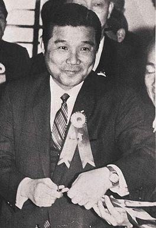
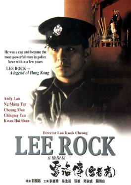
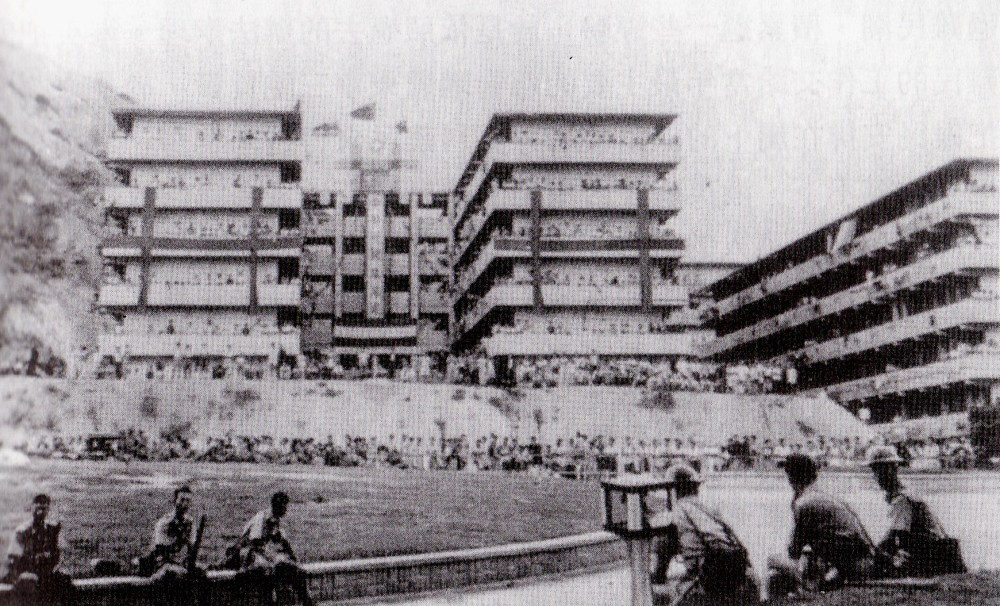
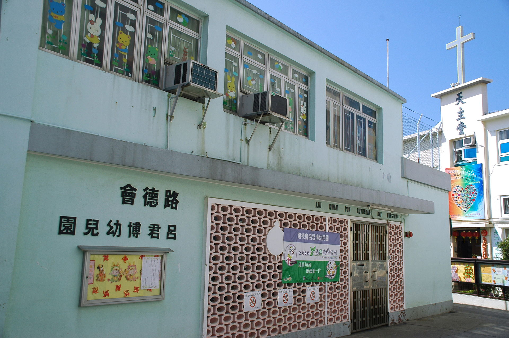
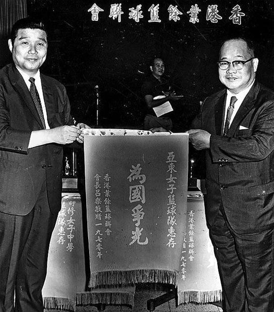

（万象特约作者：蓦然回首）

【2010年5月13日】8年前的今天，贪污五亿的传奇探长雷洛安享晚年，病逝加拿大

【刘德华主演的雷洛】

1991年，香港电影《五亿探长雷洛》上演。电影由刘德华主演，讲述了雷洛从警察一步一步爬上警长高位，并蜕变为贪腐大员的传奇故事。影片上映后极受欢迎，雷洛也因此成了香港电影中的一个品牌。

雷洛的原型，名叫吕乐，1920年，出生于广东海丰县。传言吕乐原本是文盲，签名时都是画两个圆圈（“吕”），一个向下 的箭头（“落”，谐音“乐”）。他来到香港后，擦过鞋、卖过报，拉过人力车。20岁加入香港警队。

【扫荡黑社会的总探长】

吕乐担任警察期间，最为人称道的一次案件是：1955年（35岁），他大破钻石山14K的群英大会！

14K是以香港为总部的三合会，是香港最大的黑社会组织，有100多年的历史了。当时，百余名14K黑社会份子在钻石山一所学校内大排筵席，吕乐不动声色，带队一网打尽。自此吕乐以扫荡黑社会而闻名警界。

1956年，香港右派发动的双十暴动。由于吕乐对14K等黑社会组织十分熟悉，得以排上用场，受到高层关注。不久，晋升为新界区探长。1962年，吕乐获得英国女皇颁发的殖民地警察奖章。他和另一位知名探长蓝刚，一同晋升为总探长，分别管辖香港区和九龙区。

（1956年，双十暴动中，警方防暴队与群众对峙，外墙悬挂的大型“双十”徽牌清晰可见）

【收保护费的警长五亿探长】

吕乐位高权重，纵横黑白两道，呼风唤雨。他安排警察在管区内收取保护费，贪污了大量钱财。1967年，香港当局有所察觉，将吕乐与蓝刚的总探长职位互换，管理辖区对调。第二年，吕乐请求提前退休。

1973年，吕乐和妻子以及8名子女，移居加拿大。他离开香港时，拥有五亿港元的身家，被称为“五亿探长”。

（位于长洲教堂路的路德会吕君博幼儿园）

【安享晚年的大贪官】

1974年，香港廉政公署成立，吕乐的巨额财富与官职明显不相称，成为追缉的最大目标。然而，吕乐已经移民加拿大，鞭长莫及。

1979年，吕乐在台湾台北市买下一座豪宅。从此长居台湾30多年，偶尔返回加拿大。2010年5月13日，患胃癌晚期的吕乐在加拿大温哥华病逝，终年90岁。

他的一生被视为传奇，大肆贪污后，居然得以逃脱，安度晚年。这也算得上是一个奇迹了！

（吕乐（左）给篮球队颁奖）

（本文是万象历史·人物传记写作营的第22篇作品，是营员“蓦然回首”的第4篇作品）

