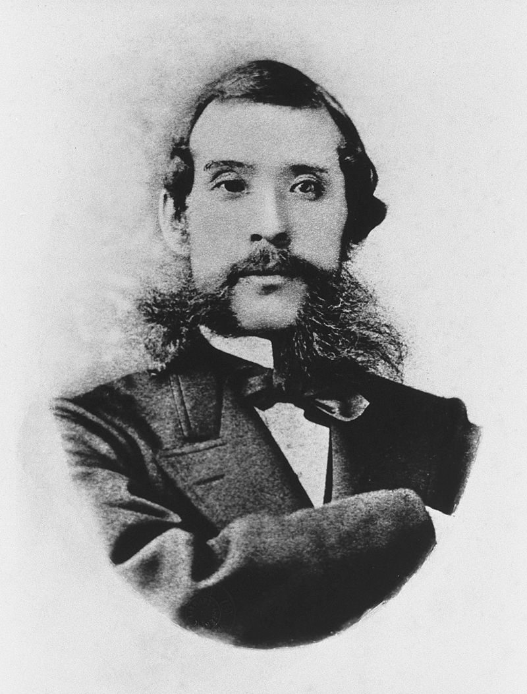
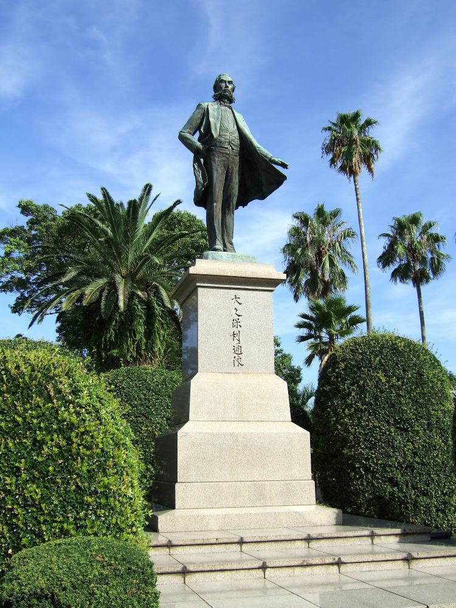
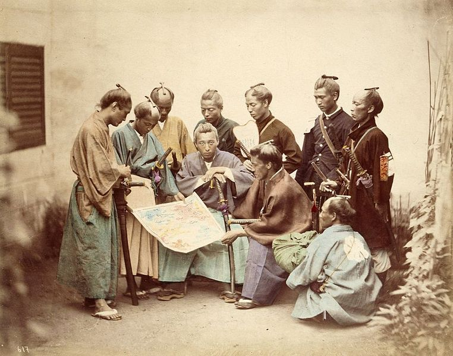
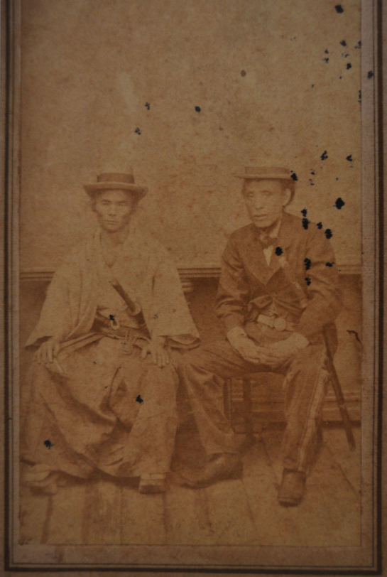
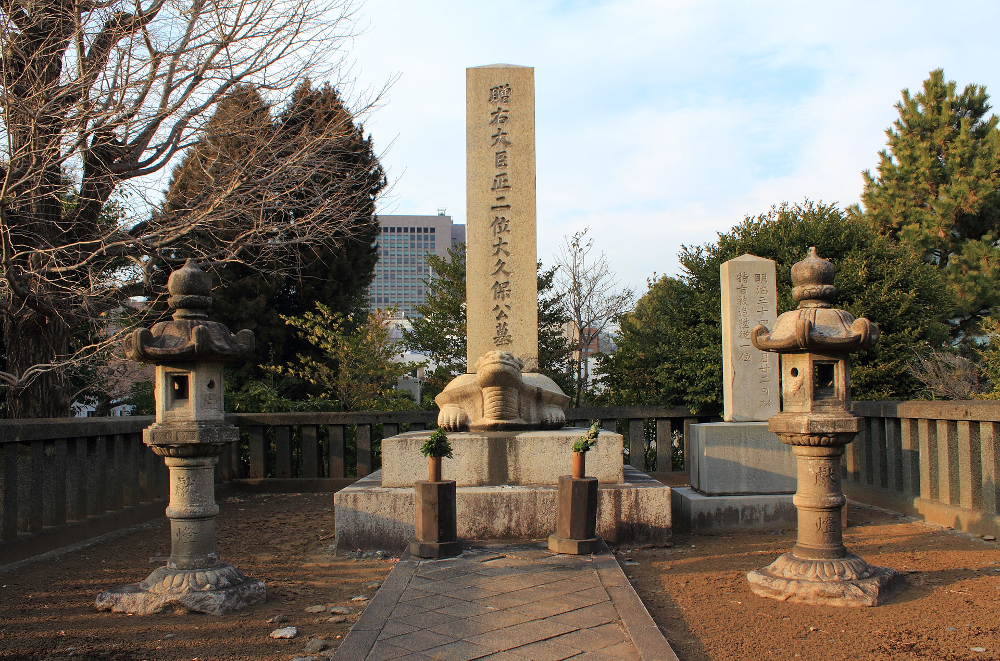

（万象特约作者：雪爪淤泥）

【1878年5月14日】140年前的今天，日本明治维新崛起的最大功臣之一大久保利通被刺身亡

【以清朝为鉴的精忠组】

1830年9月26日，大久保利通出生于日本萨摩藩（今鹿儿岛）的下级武士家庭。少年读书期间，结识了西乡隆盛。大久保的武术表现不佳，但学习成绩不错。1846年（16岁），大久保成为萨摩藩的一名书记员。在随后的20年里，他和西乡隆盛两人，逐渐掌握了萨摩藩的实权。

1868年（38岁），大久保等40余人结成政治团体“精忠组”，大家经常聚会讨论天下大事，思考如何使日本免蹈中国鸦片战争中失败的覆辙。 

（在鹿儿岛的大久保利通雕像）

【要富国强兵的大藏卿】

同年，大久保与朝廷公卿合作，发动了宫廷政变。朝廷发布“王政复古大号令”，宣布废除幕府将军。在随后的戊辰战争中，西乡隆盛消灭了幕府，明治新政权建立起来了。

（戊辰战争中，萨摩藩的武士们）

 1871年6月，大久保任大藏卿（财政部部长），手握大权。为了了解西方，明治天皇派出以岩仓具视为特命全权大使，大久保为副使的“岩仓使团”，历时1年10个月，巡访欧美10多个国家。对日本决定西化，起到了至关重要的作用。

其中，德国首相俾斯麦接见“岩仓使团”，说：“方今世界各国，……乃强弱相凌，大小相侮。弱小国家要想独立自主，必须振兴国力，既要富国，又要强兵！”大久保非常认同。

（走访欧美的岩仓使节团，大久保利通（右一））

【剪掉长发的内务卿】

1873年10月（43岁），日本政府为是否征伐朝鲜争论不休，形成了“征韩派”和“内治派”两派。最终，“内治派”取得了胜利，大久保任内务卿，掌控大权。这段时间被称为大久保政权。

大久保在政治上，学习英国，以建立君主立宪作为理想；在其他方面，则学习德国，大力推行“殖产兴业、文明开化”政策。如三菱公司就在此时起家，得到政府连续15年、每年25万日元的补助金。

作为“文明开化”的带头人，大久保虽然不会跳交际舞，但也常常出席舞会。他还率先剪短长发，朝见天皇，震惊朝野。10天后，明治天皇也剪短头发，群臣只好竞相仿效。文明开化政策迅速得以推广。

【被瓦解的武士阶层】

1874年，日本派兵侵略台湾，1875年侵略朝鲜。大久保认为，日本最大的外部敌人是俄国。他力排众议启用戊辰战争中的对手榎本武扬，派他出使俄国。榎本武扬不负众望，与俄国签订了《库页岛、千岛群岛交换条约》，解决了日本的北方边患问题。

1876年，发布了废刀令，强力推行“秩禄处分”，剥夺了武士阶级的俸禄，从而使得日本武士阶级彻底瓦解，大大促进了明治维新的进程。

（曾经是带刀武士的大久保利通（右））

【还有后来人的刺杀】

1878年5月14日，大久保在去上班的路上，突然遭到6名“征韩党”的袭击，大久保当场死亡，时年48岁。

大久保死后，伊藤博文等人继续推行大久保的“殖产兴业、文明开化、富国强兵”三大政策！经过这几十年的明治维新，日本迅速强大起来，把羸弱的大清国踩在了脚下。

（大久保利通之墓）

（本文是万象历史·人物传记写作营的第23篇作品，是营员“雪爪淤泥”的第4篇作品）