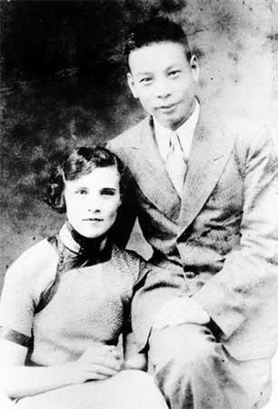
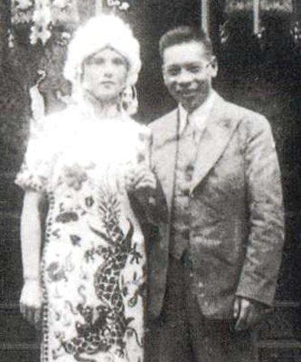
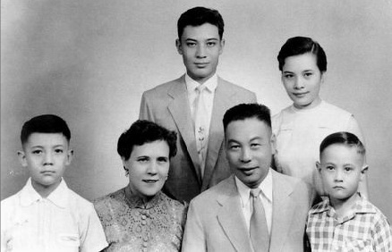
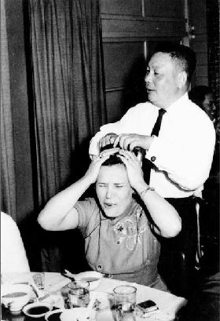
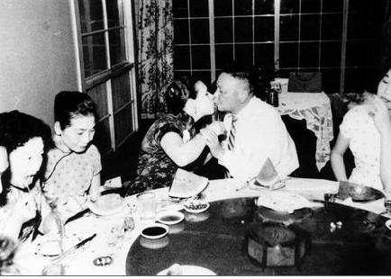
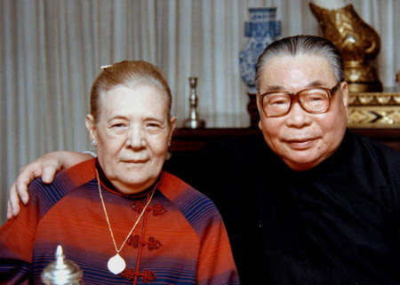

（万象历史特约作者：南山南）

【1916年5月15日】102年前的今天，来自俄罗斯的蒋家第一夫人蒋方良出生

【异国情侣，缔结姻缘】

1916年5月15日，蒋方良出生于西伯利亚山区的一个工人家庭，原名芬娜·伊巴提娃·瓦哈瑞娃。自幼父母双亡，和姐姐相依为命。

1933年（17岁），芬娜邂逅了正在苏联孙逸仙大学就读的尼古拉。尼古拉23岁，正是蒋介石的儿子蒋经国。关于他们的相识，有不同的版本。有说蒋经国英雄救美，也有说芬娜美人救英雄。但不管如何，他们相爱了。

1935年，在西伯利亚乌拉尔重型机械厂的工人俱乐部里，两人结婚了。

（在苏联期间的芬娜（蒋方良）与蒋经国）

【别离故土，开始蒋家生活】

1937年，芬娜跟随蒋经国离开苏联，来到中国。一开始她对中国的礼仪很不熟悉，做了很多“错事”。在祭拜祖先时，蒋家人都跪在地上，她却站着鞠躬。而且，蒋介石很不满她的国籍，时常会责骂她。

芬娜没有做任何辩解，非常温良恭顺。蒋介石逐渐接受了她，并给她改名为蒋方良。不久，蒋经国和蒋方良在溪口举行了中式婚礼。

婚后，蒋方良努力学习中文和礼仪。几年下来，她已经能说宁波话、能写毛笔字、还能画中国画。蒋方良得到了蒋家人的认可，成为名副其实的蒋家儿媳妇。

（芬娜和蒋经国的结婚照）

【洋夫人唱京剧，座无虚席】

1939年，抗战正酣，蒋经国到赣南任职。蒋方良陪同一起，到赣南办起了孤儿院，组建了抗日妇女救国会。她带头唱京剧为难民募捐。当她在舞台上，把《苏三起解》，唱成了“刹山利了翁通贤，匠身乃到度节钱”，观众哗然哄笑。

第二天，《赣州日报》刊登新闻：“昨晚演出天下第一剧，洋夫人演苏三，剧中唱词十分精彩，令人捧腹。”一时间，洋夫人的《苏三起解》轰动赣州城，剧场座无虚席，募集了大量善款。

【突如其来的婚外情】

蒋经国在赣州任职期间，认识了年轻貌美的章亚若，产生了婚外情。蒋方良察觉后，没有大吵大闹，在不安和恐惧中，保持着克制忍耐。甚至在蒋介石和宋美龄过问时，也没有过激抱怨。1942年，章亚若在桂林产下双胞胎后，突然猝死。坊间传言是被谋杀。

一波未平一波又起。1944年，梅兰芳的弟子，梨园名伶顾正秋又让蒋经国眼前一亮。蒋介石以“断绝父子关系”严重警告。蒋经国只好收敛，这段婚外情这才作罢。

（1950年，蒋方良和蒋经国的全家福）

【蒋介石褒奖，贤良慈孝】

这两段感情危机，让蒋方良心有余悸，性格也不像以前那样开朗。国民党败退台湾后，蒋方良深居简出，相夫教子成了她的日常。1966年（50岁）， 蒋介石亲笔写了“贤良慈孝”的横幅送给她，算是对她的极大肯定。

（蒋经国耍宝，戏弄蒋方良）

（蒋经国、蒋方良夫妻俩率性相吻）

1978年，蒋经国就任总统，蒋方良成为第一夫人。但她并不参与政治活动，也不与其他官太太来往，基本是足不出户。保龄球、高尔夫球、逛街、美容、看电影等，曾经她热衷的活动，也都离她远去。因此，在民众中显得很神秘。

（蒋经国和蒋方良夫妇）

【丧夫丧子，晚景凄凉】

1988年1月，蒋经国去世。之后的8年时间里，蒋方良的三个孩子（将孝文、蒋孝勇、蒋孝武）也先后离她而去。丧夫丧子的打击，让她在家中经常抱着全家福发呆，陷入对过去的回味之中。

2004年12月15日，蒋方良因为肺肿瘤导致呼吸衰竭，在台北荣民总医院病逝，享年88岁。临死之前，她询问医师：“我死了以后，可不可以和我先生葬在一起？”

（晚年的蒋方良）

（国民党向蒋方良追颁奖章）

（本文是万象历史·人物传记写作营的第24篇作品，是营员“南山南”的第4篇作品）