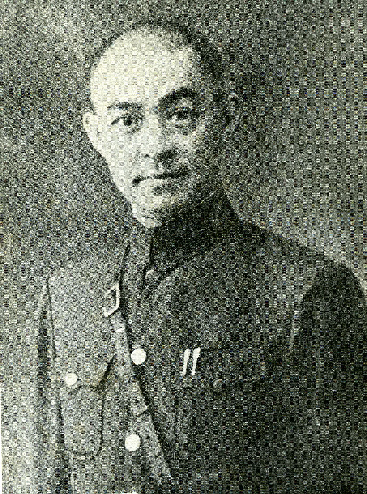
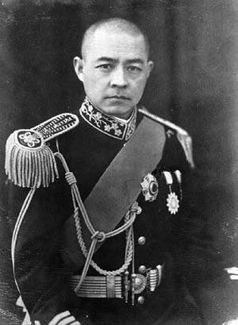
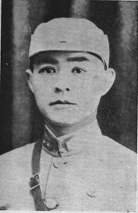
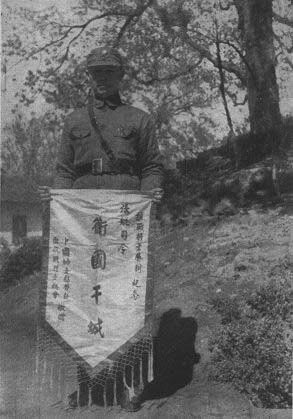

（万象历史特约作者：隔壁老孙）

【1940年5月16日】78年前的今天，曾随团访问日本的集团军总司令张自忠阵亡牺牲

【跟着老乡投笔从戎】

张自忠，1891年8月11日出生于山东临清县，父亲曾任江苏省赣榆县知县。他6岁读私塾，从小特别有正义感。关羽、岳飞的忠义和浩然之气对他影响巨大。14岁时，父亲去世，回到临清。

1910年（19岁），张自忠考入天津北洋政府学堂。1911年，辛亥革命爆发后，张自忠加入了同盟会。

1914年，他前往奉天（今沈阳）投奔身为团长的老乡，参了军。1916年，护国战争爆发，他所在的部队被派到湖南长沙镇压护国军。结果战败，部队瓦解。

【冯玉祥的左膀右臂】

他改投了冯玉祥的第十六混成旅。冯玉祥很喜欢他，让他直接做了中尉，不久升任排长、连长、营长。

1924年，第二次直奉战争爆发。冯玉祥暗中班师回京，发动了北京政变，将溥仪驱逐出了皇宫。张自忠奉命从北路出击，截击吴佩孚的交通兵团，然后又驱逐英军，占领丰台，立了大功。

1930年，中国近代史上规模空前的军阀混战——蒋冯阎中原大战爆发，双方投入的兵力高达130万人。张自忠任第6师师长，作战非常勇猛，屡建奇功！

【长城抗战的英雄】

中原大战结束后，南京政府整编全国陆军，张自忠任第二十九军第三十八师师长。

1933年3月，日军先头部队以128名骑兵兵不血刃占领了热河省会承德。热河沦陷，举国震惊。二十九军奉命在长城一线阻击日军，这是张自忠有生以来第一次同日军交战。与日军激战七日，一度击退日军。这是抗日战争前期中国军队少有的胜利之一。

第二十九军的军官共11人，因此获颁青天白日勋章。

【访问日本的“汉奸”】

1935年6月，国民政府与日军签订《何梅协定》，第二十九军退出河北省，进驻平津。1936年6月，张自忠任天津市长。

1937年3月，日军邀请军长宋哲元访日。宋哲元则命张自忠率团访日，从4月23日至5月29日，张自忠访问了东京、大阪、神户、奈良、名古屋等地。虽然张自忠发表声明称仅考察日本工业，但国内舆论并不相信，自始张自忠被视为亲日派，甚至是汉奸。

7月，卢沟桥事变爆发！张自忠奉命代理北平市长，全城张贴带有张自忠署名的安民告示。于是京津各界舆论哗然，认为张自忠做了汉奸！他发表声明，辞去了所有职务后离开了北京！

【抗日的集团军总司令】

1938年，张自忠任第五十九军军长。在临沂战役中，与日军激战七昼夜，将日军号称“铁军”的板恒师团击溃。粉碎了日军向台儿庄前线增援的计划，保证了台儿庄大捷的胜利。

1939年，升任第卅三集团军总司令。在随枣会战中，张自忠率第五十九军击退冈村宁次任军长的日军第11军。随后发动冬季攻势，攻击日军第13师团，击退日军。这是抗日战争期间正面战场惟一一次战略性进攻的战役。

【阵亡的最高将领】

1940年，日军为了控制长江交通、切断通往重庆运输线，集结30万大军发动枣宜会战。5月16日，张自忠率领的1500多人被近6000名日军包围，终因寡不敌众全军覆没，张自忠战死。他抗战中阵亡的中国最高将领。

日军发现张自忠的遗体，审认无误后，将其埋葬，并竖木牌上书“支那大将张自忠之墓”。当天深夜，日军设在汉口的广播电台，插播了张自忠阵亡消息。

【举国追悼的革命烈士】

第三十八师师长黄维纲获报后，派便衣队将遗体夺回。5月28日，灵柩抵达重庆，蒋介石亲临致祭，抚棺痛哭，随后举行国葬。8月15日，延安各界举行追悼大会，毛泽东送“尽忠报国”挽词。妻子李敏慧，因病在上海疗养，闻耗绝食而死。

1947年3月13日，北平市政府颁令，将铁狮子胡同改为张自忠路，该路名沿用至今。1982年，民政部批准，追认张自忠为“革命烈士”。

（本文是万象历史·人物传记写作营的第25篇作品，是营员“隔壁老孙”的第5篇作品）