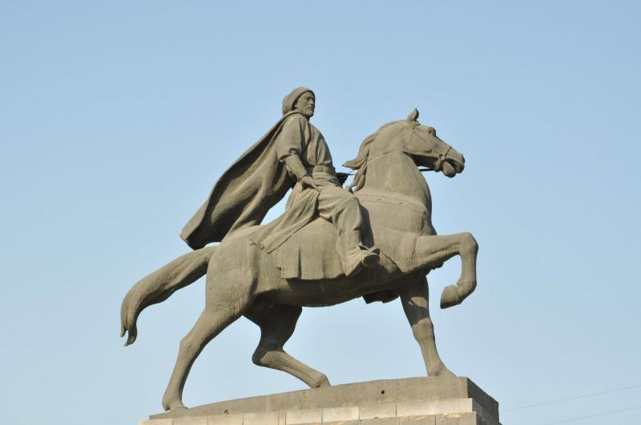
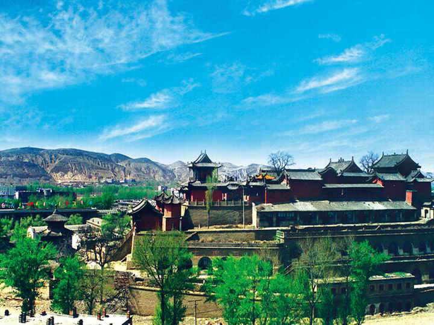
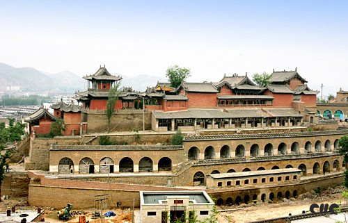
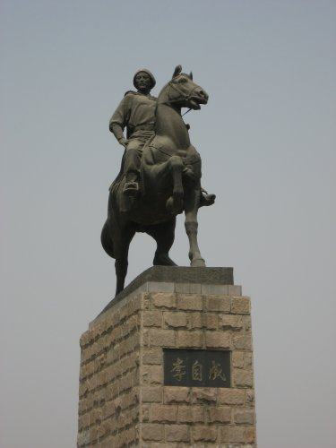
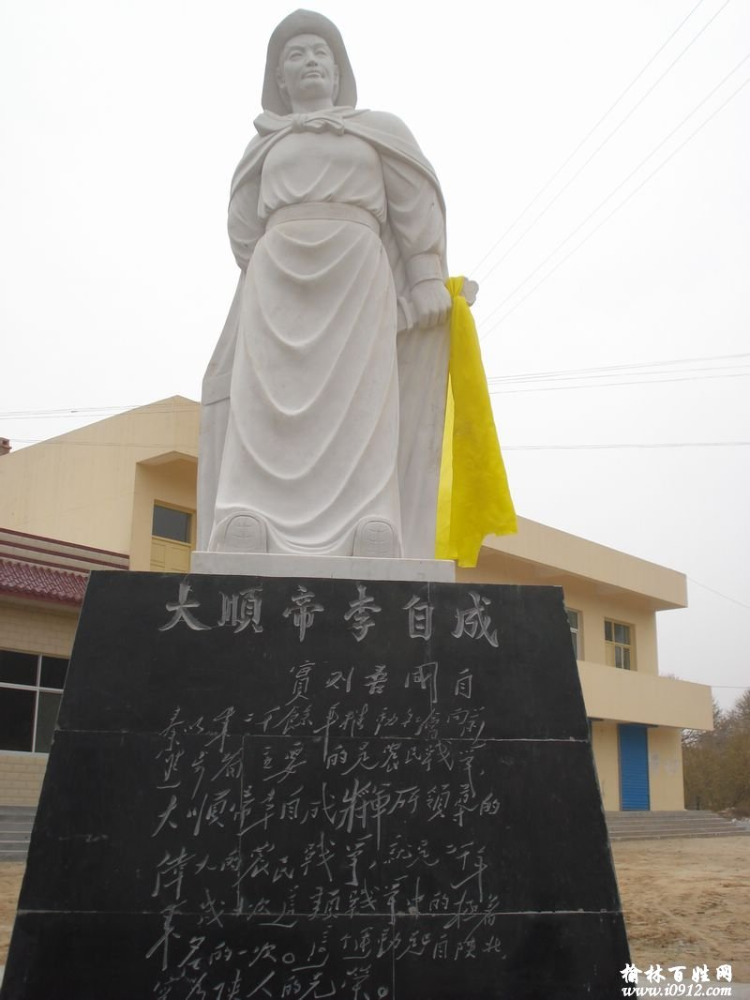
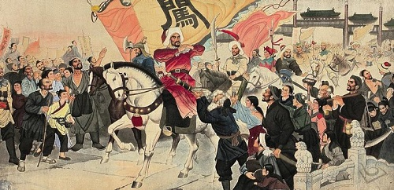
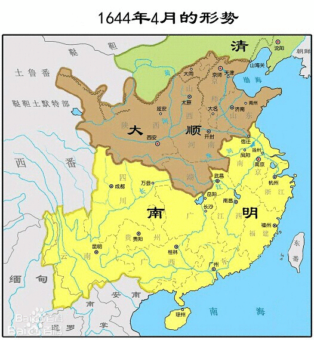
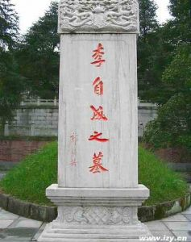

（万象特约作者：东西望）

【1645年5月17日】373年前的今天，与清军神配合的农民领袖李自成被农民杀死

【杀人的下岗邮差】

1606年9月22日，李自成出生于明朝陕西米脂李继迁寨。李继迁是党项族人，是600年前西夏国的开创者。村里人代代相传，说是李继迁的后人，也就是说李自成是党项族人。

1628年（22岁），银川驿站招募驿卒，负责传递朝廷公文，李自成被选中，往返于榆林、米脂、延安等地。然而当年全国驿站大裁员三分之一，李自成失业回家，并欠了债。

李自成回到家乡，打死债主，杀了与人通奸的妻子，逃到甘肃甘州（今张掖市甘州区）参了军。不久，因为欠饷问题，李自成又杀死上司，发动了兵变。

（陕西米脂的李自成行宫）

【车箱峡的诈降】

也就是这一年（1629年），后金第一次入塞，北京震动。李自成起事后，转战汉中、陕北等地，先后参加了多支农民军。1633年（27岁），李自成东渡黄河，投奔在山西的舅父“闯王”高迎祥。

同年，明朝将领曹文诏率千人关宁铁骑，击败山西农民军。高迎祥、李自成、张献忠等人逃到河南被围困。1634年，后金军第二次入塞，曹文诏被调走，农民军得以突围。

但突围后的农民军误入山势险峻，只有一个出口的车箱峡（今陕西省安康市）。迫于无奈，李自成只好向官兵投降，被遣送回乡。刚一上路，李自成就杀了官兵，再次反叛。

（陕西米脂的李自成行宫）

【刨明朝皇帝祖坟的闯王】

1635年（29岁），洪承畴任五省总督，围剿农民起义，各支农民军都败退到河南洛阳一带。于是，十三家农民起义军在河南荥阳召开大会。会上，李自成提出“分兵定向、四路攻战”策略，得到大家认可。

会后，高迎祥、张献忠、李自成率部向东，攻下南直隶凤阳，刨了明朝皇帝的祖坟，烧掉朱元璋出家的“皇觉寺”，震惊天下。洪承畴被罢免，新上任的五省总督卢象昇，在郧阳山区（今湖北十堰）包围了高迎祥。

恰在这时，后金改名为清，第三次入塞。卢象昇被调走，高迎祥得以突围。然而，不久高迎祥从子午谷进攻西安时，战败被杀。李自成被推为“闯王”，继续征战四川、甘肃、陕西一带。

（北京昌平的李自成雕像）

【陷入绝地的17人】

1637年（31岁），明将杨嗣昌提出“四正六隅，十面张网”策略，限制农民军的流动性，各个击破。该策略成效明显，不久张献忠兵败投降，李自成也战败，带着仅存的17人躲到陕西东南的商洛山中。

这时，清兵第四次入塞，卢象昇战死，明军大量调往辽东。李自成躲在山中，得以喘息，并娶妻生子，暗中和已投降的张献忠来往。

（陕西米脂县的李自成雕像）

【东山再起的福禄宴】

1639年（33岁），张献忠在谷城（今湖北襄阳）再次反叛，李自成也从商洛山中率数千人马杀出。1640年，明军主力进入四川追剿张献忠，李自成则进入河南，提出“迎闯王，不纳粮”的口号，大量收留难民，发展到数万人。

1641年，李自成攻克洛阳，杀了万历皇帝的儿子福王朱常洵，将他的肉和鹿肉一起煮，称为“福禄宴”，与将士们大快朵颐。

1642年，李自成拥兵百万，占领了湖北大量州县。随后，李自成掘开黄河，攻入开封。与此同时，洪承畴战败，投降了清军。11月，清军第五次入塞，深入山东，劫掠无数。

【攻入北京的大顺帝】

1643年（37岁），李自成在襄阳称“新顺王”，张献忠在武昌称“大西”王。10月，李自成攻破潼关，占领了陕西全省。1644年，李自成在西安称帝，张献忠在成都称大西皇帝。

称帝后，李自成率军五十万进攻北京。4月，李自成攻入北京，崇祯皇帝在景山自缢身亡。李自成下令将崇祯“礼葬”，并进行公祭。

【吴三桂的清军入关】

随后，李自成亲率十万大军奔赴山海关，征讨不肯投降的吴三桂。战败的吴三桂，投降清朝的多尔衮，引清兵入关。两军联合，击败了李自成。李自成退回北京，匆忙称帝后撤离。

吴三桂径直追击李自成。在定州清水河（今河北省定州市），李自成再次大败，退往西安。此时，清军入主北京，然后兵分两路，一路攻打南明，一路攻打李自成。

1645年，清军红衣大炮攻破潼关，李自成退入湖北，节节败退。

【被农民杀死的农民领袖】

1645年5月17日，在湖北通山县（另说通城县）的九宫山，李自成被地方农民武装杀死，尸首不知何处。李自成死后，农民军愤怒地扫荡了九宫山区。余部在李自成夫人高桂英的率领下，进入湖南，不久就失败了。

民间传言，李自成并没有死，而是在湖南石门县夹山寺削发为僧，法号奉天玉和尚。著名的湖南女作家丁玲，也自称是李自成的后人。

（本文是万象历史·人物传记写作营的第26篇作品，是营员“东西望”的第8篇作品）
