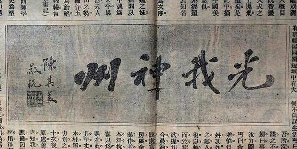
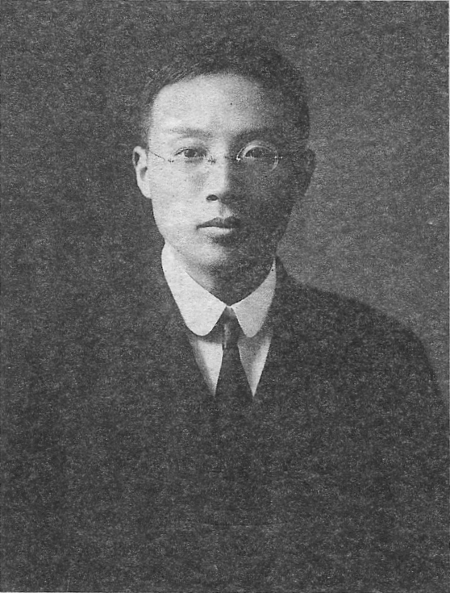
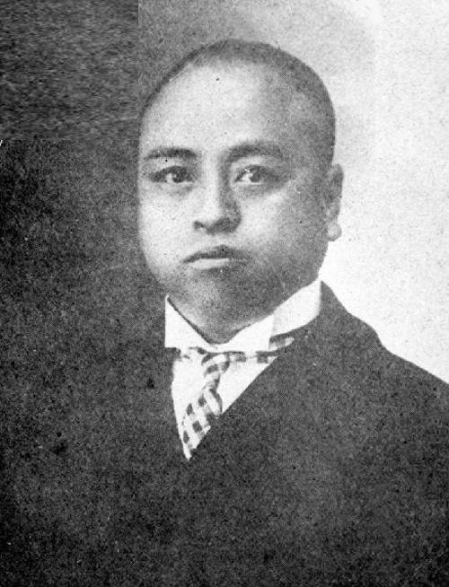

（万象历史特约作者：老骥伏枥）

【1916年5月18日】102年前的今天，革命首功之臣、民国第一豪侠陈其美被刺杀

陈其美，字英士，号无为，浙江湖州吴兴人。生于1878，卒于1916，人生在世只有三十八年，活跃期更是只有短短的八年。

他是中国同盟会元老、上海青帮大佬、孙中山的左右手……大侠霍元甲是他的武师，蒋介石是他的小弟，陈果夫、陈立夫是他的侄子……孙中山说他是“革命首功之臣”，蔡元培说他是“民国第一豪侠”。

在短短的八年里，他对中国历史的走向，影响巨大。他一生褒贬不一，毁誉参半。从“大革命家”、“共和长城”到“流氓政客”、“青帮头子”，可谓中国近代史上最受争议的人物之一。 

                    

【30岁才开始的人生】

陈其美读了七年私塾，在小当铺当了12年的学徒，到上海做了两年助理会计。

1906年春（30岁），他在弟弟的资助下东渡日本，结识孙中山，加入同盟会。期间，他介绍同乡黄郛、蒋介石等入会。1908年，他回国，在上海加入青帮，以联络会党支持革命。自此他登上中国革命的舞台，写下浓墨重彩的一笔。

  【革命、革命、革命】

1911年，辛亥革命爆发，陈其美在上海宣布独立，随后南方各省纷纷独立，成为不可逆转的洪流。孙中山不止一次地说，当时响应最有力、对全国影响最大的就是上海。上海光复后，陈其美被推举为沪军都督。

1913年，孙中山反对袁世凯，发动二次革命失败。陈其美跟随孙中山东渡日本，成为中华革命党（中国国民党前身）最重要的助手。

1915年，他回到上海，领导蒋介石等人策划了上海武装起义。起义虽然失败，却促成了云南起义（护国战争）的成功，迫使袁世凯不得不取消了帝制。

（1914年7月8日，孙中山（中）在日本组织中华革命党成立时合影，左四为陈其美）

【刺杀革命者的革命者】

陈其美是青帮大佬，经常花天酒地，风流倜傥，被称为“杨梅都督”。除了私生活方面，他曾刺杀多名光复会革命同志，因此备受指责，也对中国政治的局势，产生了深刻的影响。

一是上海光复时，陈其美提前动手，事发被抓。随后，光复会的李燮（xiè）和起事成功，把他救了出来。李燮和毫无疑问是沪军都督的最佳入选。陈其美派青帮弟兄，大闹会场，并试图刺杀李燮和。李燮和逃离上海，陈其美才如愿当上了上海都督。

  

二是光复会的陶骏保，造访都督府时，被陈其美公然枪杀。陶骏保在攻打南京城时，立下第一大功。他掌握着苏浙联军中最为强大的一支，对同盟会颇有威胁。

三是暗杀光复会的会长陶成章。陈其美派蒋介石、王竹卿潜入医院，杀害了正住院的陶成章。此事震惊国内，王竹卿被缉拿归案，很快便被处死。蒋介石惶惶不安，逃去日本避风头。从此光复会逐渐没落，而蒋介石因此得到孙中山的信任，异军突起。

（被刺杀的光复会会长陶成章）

【被刺杀的革命者】

1916年5月18日，陈其美在上海法租界萨坡赛路14号（后改名英士路，1950年改淡水路至今）被枪杀。一般相信是袁世凯指使张宗昌派人刺杀的。

1917年5月12日，国民政府在上海为陈其美举行国葬，上万人送行，孙中山、唐绍仪、章太炎等人主祭。直到蒋介石去世，在葬礼规格上，陈其美仅次于孙中山。孙中山手书“失我长城”，悲痛不已。

陈其美葬于湖州市南郊。两旁石柱对联，是于右任和蔡元培所题。石碑坊匾额正中是孙中山手书“成仁取义”；左侧林森题“浩气长存”，右侧蒋介石题“精神不死”。

​     

​    （本文是万象历史·人物传记写作营的第27篇作品，是营员“老骥伏枥”的第1篇作品）

