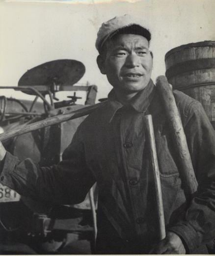
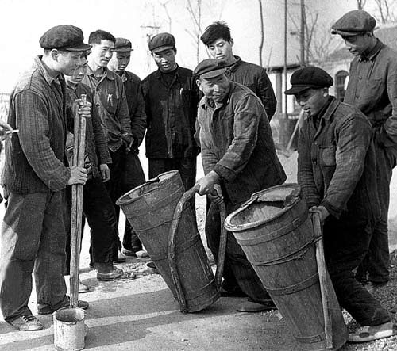
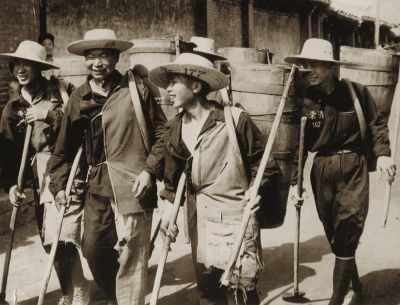
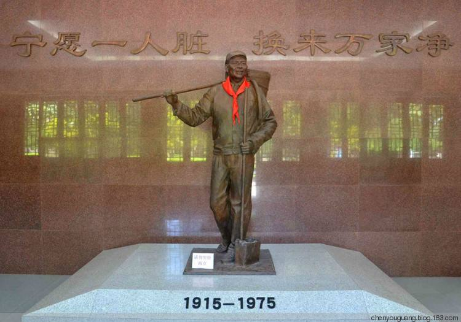
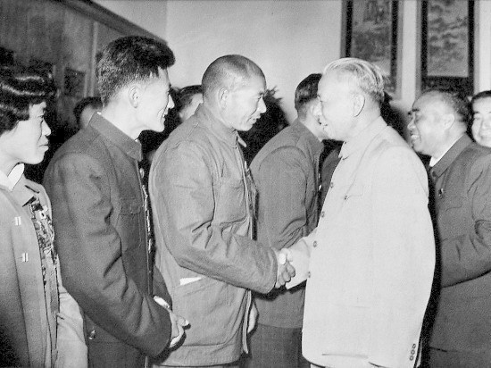
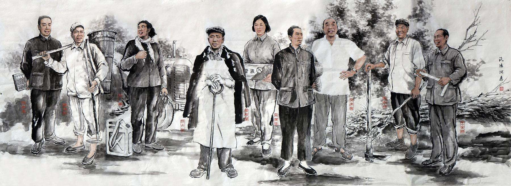

（万象特约作者：蓦然回首）

【1975年5月19日】43年前的今天，一辈子的掏粪男孩，全国闻名的大劳模时传祥逝世

【受欺凌的掏粪男孩】

1915年9月20日，时传祥出生于山东省齐河县的一个贫苦农民家庭。他14岁逃荒，流落到北京城郊宣武门的一家私人粪场，当了掏粪工。他一干就是20年，受尽了压迫与欺凌。

解放后，人民当家做主，时传祥兴奋地发现，掏粪竟也是社会主义建设事业的一部分！他被工友选为崇文区“粪业工人工会”委员，并加入了崇文区清洁队。他满怀热情，任劳任怨地投入到掏粪这项光荣的劳动之中。

【建设新中国的主人翁】

时传祥为了干好掏粪工作，动了不少脑筋。老北京平房多，四合院里人也多，茅坑浅，粪便常常溢出来，气味难闻。他总是主动找来砖头，把茅坑砌得高一些。茅坑里掉进了砖头瓦块等杂物，他总是掏完粪，再把茅坑清理干净。

他合理计算工时，将原来7个人的掏粪小组，改为5人一组，工作量不减反增，由每人每天50桶增加到80桶。他自己则每天90桶。他以主人翁的姿态，奋战在“搞好环境卫生，美化人民首都”的第一线。

1955年，他被评为清洁工人先进生产者。1956年，当选为崇文区人民代表，并加入中国共产党。1958年，担任北京市政协委员。

（龙潭公湖园内的时传祥纪念馆）

【登上天安门的掏粪工】

1959年，他被选为全国劳动模范。国家主席刘少奇握着他的手说：“你掏大粪是人民勤务员，我当主席也是人民勤务员，这只是革命分工不同。”时传祥当即表示：“我要永远听党的话，当一辈子掏粪工。”

（1959年，刘少奇接见时传祥）

这年国庆，毛泽东还邀请他登上天安门，参加建国十周年庆典。《人民日报》、中央人民广播电台等媒体，对他的事迹大为宣传。他立刻成了全国闻名的大名人。

当时的北京副市长万里、清华大学的大学生，都来拜时传祥为师，学习背粪，学习吃苦耐劳的精神。时传祥备受鼓舞，兴奋地说：“我已经干了30年的掏粪工，只要党需要，我还要再干它30年、60年！党需要我干到什么时候，我就干到什么时候。”

（50年代的全国劳模图，左二为时传祥）

【做一名称职的掏粪工】

1966年国庆，毛泽东再次邀请他，参加国庆观礼。周恩来在招待宴会上，给他敬酒。

文革发生后，他被诬为“工贼”，1971年被遣送回原籍。毛泽东、周恩来知道后，立即指示有关部门将他接回北京，给予平反，恢复名誉。

1975年5月19日，时传祥病逝北京，时年60岁。去世前，他反复叮嘱儿子，要他继承父志，一定要当一名称职的掏粪工。

.jpg)

（本文是万象历史·人物传记写作营的第28篇作品，营员“蓦然回首”的第5篇作品）