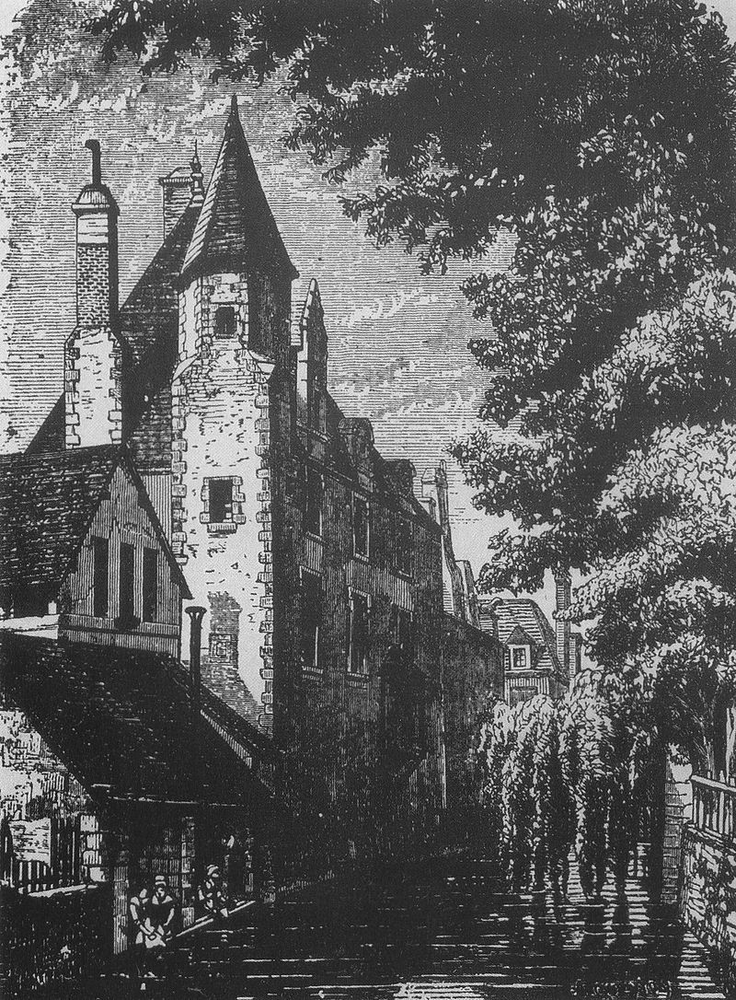
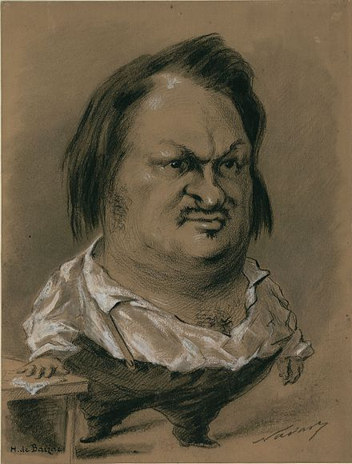
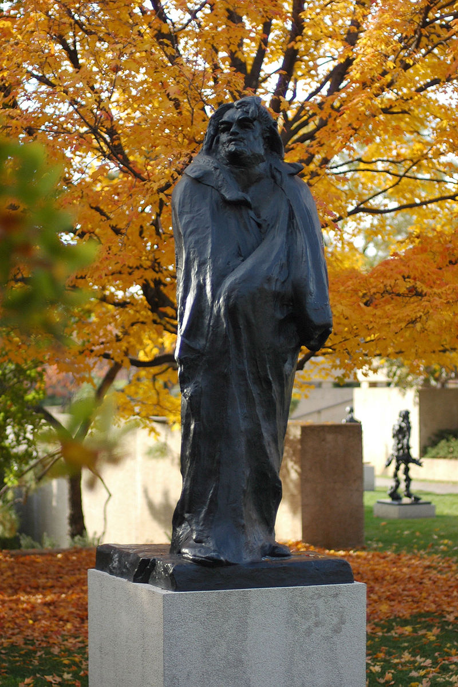
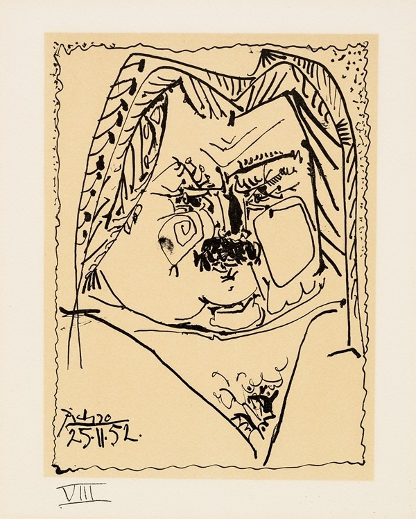
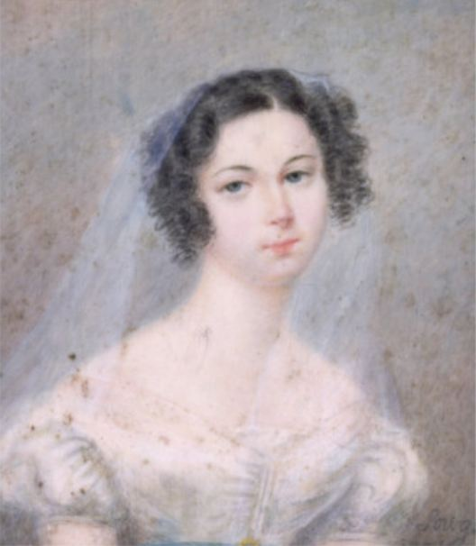

（万象特约作者：雪爪淤泥）

【1799年5月20日】219年前的今天，写尽人间喜剧，一心想娶入豪门的巴尔扎克出生

【没有母爱的童年】

1799年5月20日，巴尔扎克出生于法国。父亲是农民，非常善于钻营，积累了许多财富。母亲是银行家的女儿，坚信“财富就是一切”，两个人真是绝配。

巴尔扎克出生后，被送到郊区，由朋友抚养，读寄宿学校。他没有得到家庭的温暖，跟母亲的关系一直不好，他甚至说：“我从来没有母亲，她实在太可怕了。”

1816年（17岁），他按父亲的意愿，进入巴黎大学法学院学习，但他对法律并不感兴趣。毕业后，他拒绝家人安排好的工作，决心从事写作。

（巴尔扎克上过学的教堂）

【每一次都是失败】

为了向父母证明自己，他几乎足不出户地奋战了一年，完成了处女作诗剧《克伦威尔》。结果却遭到专家嘲笑，黯然神伤。

为了赚钱养活自己，他只好为书商炮制各种劣质小说以维持生计，后来他都不承认是自己写的。他折腾了好几年，穷困潦倒。最终，他决定弃文从商。

26岁起，他先后尝试过出版业，开办过印刷厂、铸字厂，但每次都以失败告终。4年里，他尝够了破产、倒闭、清理、负债的痛苦，最后还是由母亲出面替他还了债。

（巴尔扎克写作的阁楼和书桌）

【用笔完成拿破仑的事业】

走投无路的巴尔扎克只好放弃经商，再次开始写作。身高不到一米六的他，在书房里放了一座拿破仑塑像，在剑鞘上刻下：“他用剑未完成的事业，我要用笔来完成！”

1829年（30岁），他用真名发表了第一部小说，第二年更是一连发表了八部小说。从此他就以一种近乎自虐的勤奋，在写作的道路上一发不可收拾。

（1850年，巴尔扎克的漫画像）

【宏伟的人间喜剧】

1841年（42岁），他做了一个宏伟的规划，拟定了一个庞大的作品系列，总称为《人间喜剧》。计划要写137部，到1850年最后完成了91部，共创造出了三千个角色，几乎涵盖了法国的各个阶层。

他的作品构建出一部封建贵族的没落、资产阶级的发迹的宏伟史诗。恩格斯说：“他给我们提供了一部法国社会，特别是巴黎上流社会最真实的历史。这是现实主义最伟大的胜利！”

他的代表作品包括：《猫打球商店》（1830年），《驴皮记》（1831年），《欧也妮·葛朗台》（1833年），《高老头》（1834年），《贝姨》（1846年），《邦斯舅舅》（1847年）等等

【日夜颠倒的僧侣生活】

为完成《人间喜剧》庞大的创作计划，巴尔扎克夜以继日地连续工作了20年。他经常每天晚上6点钟上床，半夜12点起床，披上多明哥式的僧袍，点起四支蜡烛，一口气工作16个小时。只有在早上7点时沐浴，稍作休息，出版商这时会派人过来取得稿件。

他文思泉涌、疾笔如飞，比如几十万字的《高老头》，他三天内一气呵成……他的每一部作品，少则修改几遍，多则十几遍。他大刀阔斧，一直改到满意为止。一部200页的书，草稿常有2000页，经常因此与出版商发生争执。

【将死于3万杯咖啡】

巴尔扎克身高不到一米六，却很肥胖。由于贫穷，大多数情况下，他的食物很简单。但是，一旦拿到稿费，就大吃大喝，形同疯狂。有一次，他在巴黎的一家餐厅，吞下了十多片羊肉、一份萝卜炖鸭肉、一条诺曼底鲳鱼、两只松鸡，还有一百多只牡蛎……最后，他还吃了一道餐后甜点。

他不抽烟，也不酗酒，但嗜浓咖啡如命。他每天会喝下50杯的超浓黑咖啡，里面既不加牛奶，也不加糖，足以苦到让胃麻痹。他曾说过：“我将死于3万杯咖啡。”有专家统计过，他一生大约喝了5万杯。

也因此，巴尔扎克的健康从40岁后就每况愈下，到50岁便已经是重病缠身了。

（毕加索1957年画的巴尔扎克）

【一心娶入豪门的梦想】

巴尔扎克一生有许多梦想，跟有钱的贵夫人结婚便是其中之一。

24岁的巴尔扎克曾与44岁的贝尔妮夫人相恋，当时巴尔扎克一文不名，但贝尔妮夫人对他很好，经常接济他，让他感受到从小没有领略过的母爱般的温情。

他成名后，出入法国上流社会沙龙，跟许多情妇有染，并育有数名私生子。他的名作《欧也妮·葛朗台》，就是献给有夫之妇达米诺瓦夫人的，当时她正怀着他的孩子。在作品里，葛朗台太太临终时，说：“孩子，幸福只有在天上，你将来会知道的。”仿佛这正是巴尔扎克想说的话。

【梦想成真的那一刻】

后来，他又认识了一位有钱的有妇之夫韩斯卡夫人。他期望她的丈夫死后，她带着丰厚的嫁妆和自己结婚，从而彻底解决自己的经济困境。这一天，他等了9年。

1850年3月，他在俄国和相恋已久的韩斯卡夫人结婚，婚礼之后两人返回法国。巴尔扎克在途中就病倒了，回到巴黎，双目几乎失明，已经一病不起。8月18日，巴尔扎克去世了。

（1825年，韩斯卡夫人的画像）

三天之后举行葬礼，前来送葬的巴黎市民绵延好几条大街。法国著名雕塑家罗丹亲自为他塑像。他死后不久，韩斯卡夫人与一位画家同居，但仍替巴尔扎克偿还了所有债务，并为他出版全集。

（巴尔扎克之墓）

（本文是万象历史·人物传记写作营的第29篇作品，营员“雪爪淤泥”的第5篇作品）

 