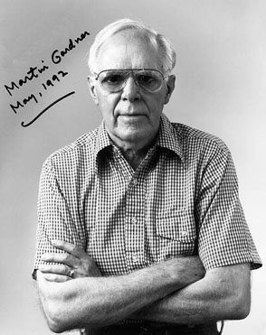
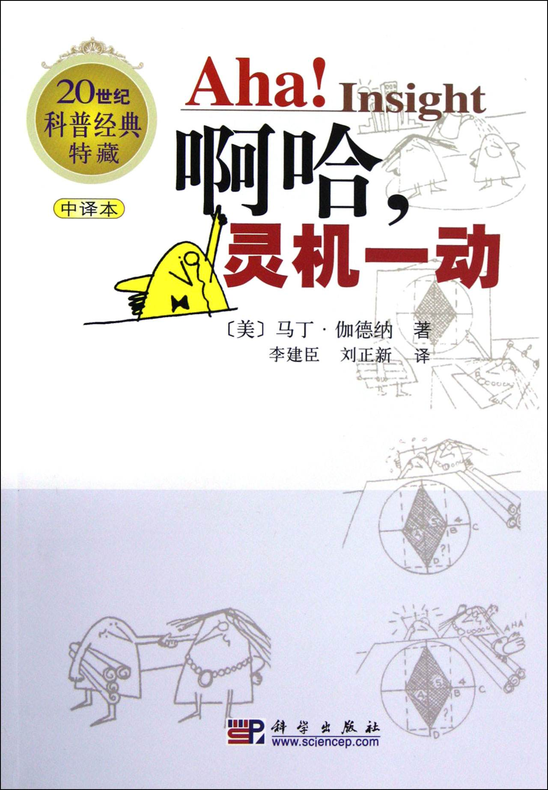
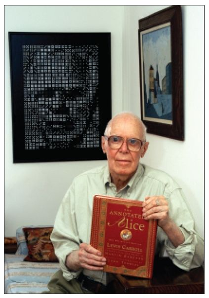
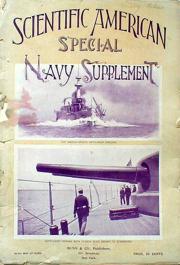
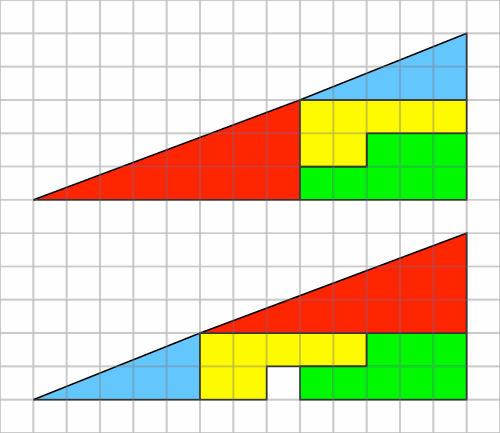
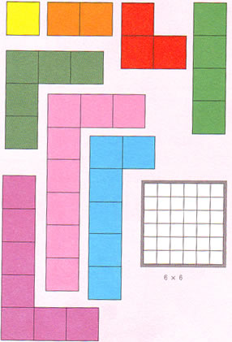
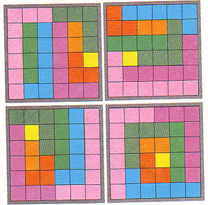
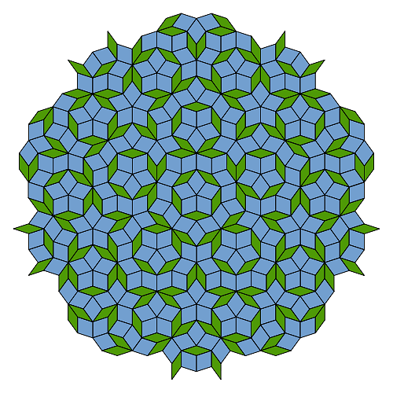
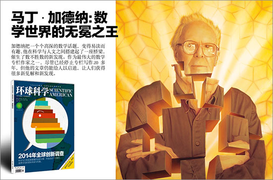

（万象特约作者：东西望）

【2010年5月22日】8年前的今天，啊哈，灵机一动的数学科普之王马丁·加德纳逝世

【啊哈，灵机一动】

高中时，我从同学家里借来一本书，名字叫《啊哈，灵机一动》。这本书简直让我疯狂！一个个有趣的谜题，折磨着我这个懵懂少年的脑细胞，在每一堂英语课上陷入了沉思。

后来我知道了，这本书的作者叫马丁·加德纳。我在书店里，找到了他的另外两本书，《啊哈！原来如此》、《矩阵博士的魔法数》。于是，妈妈再也不用担心我的学习，我顺利地度过了青葱岁月，没有动过一丝谈恋爱的念头。

今天是这个家伙8周年的忌日，我谨以此文纪念我逝去的青春。

【哲学系毕业的数学家】

1914年10月21日，马丁·加德纳出生于美国俄克拉荷马州。1936年，22岁的他毕业于芝加哥大学哲学系。没错，他毕业于哲学系，而不是数学系。

毕业后，他回家乡当了记者。二战期间，他是美国海军的随军记者，足迹遍布世界各地。战后回国，他也一直从事着自由撰稿人和编辑的工作。

【魔术的狂热爱好者】

他一生都疯狂沉迷于魔术。1956年（42岁），他写了一本给大众的魔法书《数学、魔术和神秘》，结果大受欢迎，至今仍是魔术界的经典之作。他的许多朋友都是魔术师，他毕生都在研究、推广魔术。2005年，位于好莱坞的魔术学院授予他“终身成就奖”。

他最喜欢的一本书是《爱丽丝梦游仙境》，里面的奇思妙想、数学谜语、文字游戏令他着迷。但是他发现没有谁能解开所有谜底。于是，他决定自己写一本《爱丽丝注释本》（《The Annotated Alice》），来解读书中的每一个谜题。书出版后，很快风靡美国，直至今天。

（马丁加德纳和他的《The Annotated Alice》）

【无人不知的科学美国人】

但真正让他家喻户晓的，是因为他连续25年是《科学美国人》数学游戏专栏的作者！

《科学美国人》是美国最顶级的科普杂志，撰稿者一般是各学科领域的专家，很少有人能发表多篇文章。而加德纳从从1957年开始，连续25年，每个月都发表一篇文章，共有200多篇。前无古人，后无来者！

他非常善于将抽象、深奥的数学问题，转化为易读、趣味十足的内容。他给读者展示出一个个重要而又奇妙的数学谜题，让无数人为之着迷，从此迈入数学的殿堂。他被誉为“本世纪美国最伟大的智者之一”。

【失踪的正方形】

比如，1961年5月的《科学美国人》上，加德纳给出了一个奇怪的图形：把一个三角形分割成特定的4块，然后重新组合，新的三角形与原来的三角形形状看似相同，然而第二个三角形竟然缺少了一格！

这便是著名的“失踪的正方形”。这个问题曾困扰了我和小伙伴们一整个夏天！

1993 年，加德纳总结了 5 个读者反映最热烈的主题：1、多格骨牌；2、生命游戏；3、彭罗斯贴砖；4、RSA加密；5、纽科姆悖论：谁想成为百万富翁？

【多格骨牌】

由1－8个正方形构成的下图形状，你能用它们拼成一个6x6的正方形吗？你能找到几种办法呢？

答案是4种。能拼出来的，大概都是天才！

【生命游戏】

这是一个简单模拟细胞繁殖的游戏。在简单的规则下，一个简单的起始图案，经过一代代繁殖迭代，竟产生出意想不到的结果。这个游戏已经成了计算机程序开发者必练的项目之一。

【彭罗斯贴砖】

我们知道，瓷砖都是长方形或正方形的，可以铺满整个地面。用其他形状如何能铺满地面呢？这个问题甚至让一个家庭主妇为之着迷，并提出了几个精巧的方案。

1974 年，英国数学家彭罗斯巧妙地构造出了一系列非周期性的铺砖法，也就是无规律的铺砖法。其中最简单的只含两个砖块，分别是 36 度菱形和 72 度菱形。

【RSA加密】

这个由3个人名拼成的加密算法，大概是现代计算机领域最重要的贡献之一。由于计算两个大素数的乘积很容易，但反过来，进行因子分解却非常困难，从而解决了加密密钥的公共问题。

加德纳向读者发出了一个挑战，请大家试着去解码一条信息，其中需要分解一个129 位的整数。挑战发出，无数人为之努力。过了17年后，一个庞大的合作组，靠着 600多名自愿者和1600台计算机，才最终完成了这个挑战。

（发明RSA算法的三个人）

【纽科姆悖论】

游戏玩家面对两个箱子，一个透明的A箱，里面有1000元，还有一个不透明的B箱。玩家可以选择全部拿走两个箱子内的东西，或者只能拿B箱中的。

有一个能准确预测未来的巫师。如果他预测玩家会拿两个箱子，B箱里就什么也不放；如果他预测玩家只拿B箱，就在B箱里放入100万。他做完预测，放好B箱的东西后，就离开了。现在你是玩家，到底是只拿B箱？还是两个都拿呢？

这是一条悖论。有人说，关键是看你相信宿命论，还是相信自由意志？

2010年5月22日，马丁加德纳去世了，享年96岁。感谢他留给我们的瑰宝。

（本文是万象历史·人物传记写作营的第30篇作品，营员“东西望”的第9篇作品）

