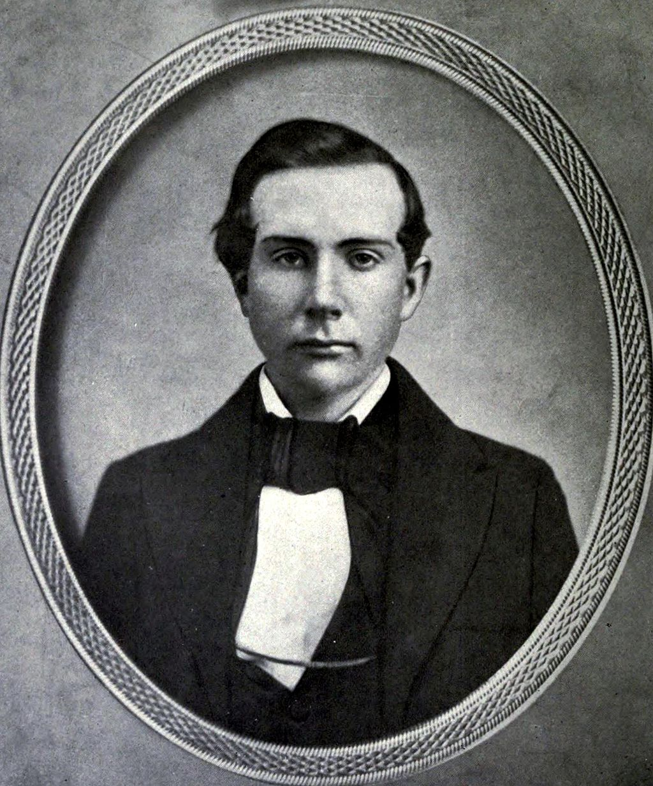
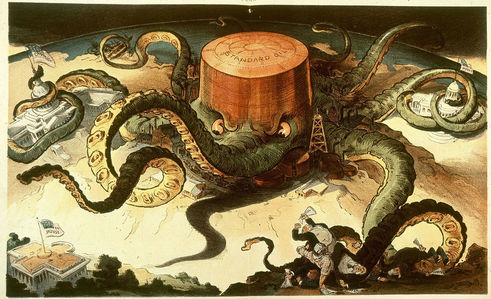
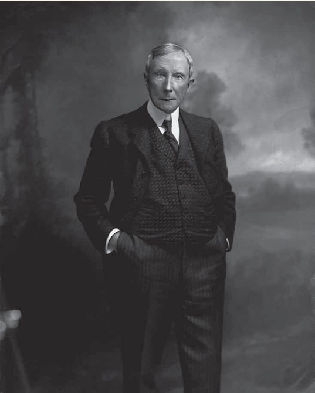
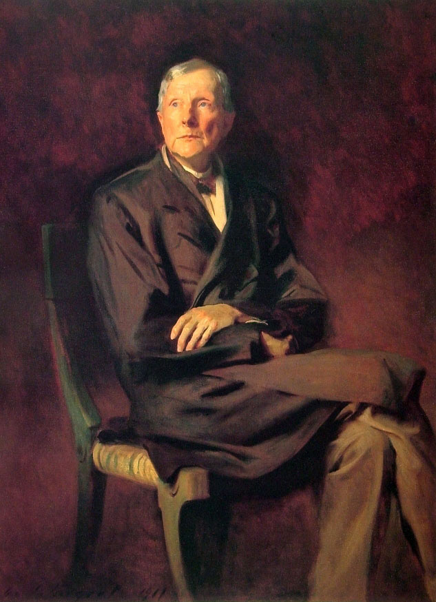

（万象历史特约作者：十尃）

【1937年5月23日】81年前的今天，靠垄断起家，靠反垄断发家的世界首富洛克菲勒去世

（1885年，46岁的洛克菲勒）

【冷酷无情的性格】

1839年7月8日，洛克菲勒出生于纽约州中部的小镇，家庭贫穷。1858年（19岁），洛克菲勒工作三年后，毅然决定创业。他的父亲拿出1000美元对他说：“要付10%的利息！”没过多久，当他缺钱时，父亲却提前催讨债款，对他 的哀求无动于衷。

洛克菲勒继承了这种冷酷无情的商业性格。在后来全国石油大兼并中，他毫不犹豫地让自己的弟弟，惨淡破产，陷入贫困。弟弟对他恨之入骨，将自己两个夭折儿子的棺木从祖坟中迁出，自己死后也葬在远离家族墓地的小山坡上，不愿与洛克菲勒为邻。

（1857年，18岁的洛克菲勒）

【孤注一掷的拍卖】

1858年4月1日，洛克菲勒与合作伙伴克拉克，创办了一个商行，主营农产品贸易业务。1859年，五大湖区的克利夫兰钻出了石油，商人们蜂拥而至，迅速建起近百家炼油厂。

1863年，洛克菲勒也来到这里，建了一座炼油厂。炼油业竞争激烈，公司巨亏，两位创始人洛克菲勒与克拉克，对前景发生了分歧。

1865年2月2日（26岁），两人举行内部拍卖会，要拍卖石油生意。从报价500美元起，你来我往，不断攀升，最后洛克菲勒咬牙喊到72500美元，才最后胜出，控制了克利夫兰最大的炼油厂。

 （洛克菲勒的妻子劳拉，也是亲密的商业伙伴）

【落井下石的并购】

1870年（31岁），他建立了标准石油公司。这时由于过度投资，90%的炼油厂都在亏损，整个行业面临崩盘。但洛克菲勒深信石油行业的前景，不断收购濒临破产的炼油厂。

1872年，洛克菲勒做出历史性决定，要收购克利夫兰所有的炼油厂。从2月17日到3月28日的短短39天里，他一口气吞掉克利夫兰26个竞争对手中的22个。期间还创造48小时内连续买下6家炼油厂的疯狂记录。

到1879年（40岁），标准石油已经掌握了全美90%的炼油产业，形成庞大的垄断系统。

（标准石油疯狂并购的漫画）

【垄断下的全球首富】

也就是从1879年春天开始，他不得不接受无休止的“密谋垄断”、“操纵油价”的指控和调查。有一段时间，他整日躲在山里，以远离纠葛。幸好这个调查长达几十年，并没有妨碍标准石油的迅速发展，洛克菲勒也赚取了巨额财富。

1889年（50岁），他的净资产值达1.5亿美元，是历史上的第一位亿万富豪与全球首富。

（1900年，61岁的洛克菲勒）

【反垄断的超级富豪】

1911年5月（72岁），经过长达32年的调查，美国联邦最高法院最终通过《反垄断法》，最后裁决：标准石油公司必须在6个月内解体。 随后，标准石油被拆分为34家公司，洛克菲勒掌控这些公司75%的股票。

（1901年，洛克菲勒被描绘为资本皇帝的漫画）

这时，美国汽车业正朝气蓬勃，石油股票一路飙涨。洛克菲勒的个人财产也随之水涨船高。1914年时，他财富总值达9亿美元，占美国GDP的2.4%，折合今天的3000亿美元以上。洛克菲勒不曾想到，他竟然成了《反垄断法》的最大受益者。

（1917年，78岁的洛克菲勒）

1937年5月23日，洛克菲勒去世了，享年98岁。他的子孙继承了他的事业，洛克菲勒家族成为美国最负盛名的超级富豪之一。

（洛克菲勒家族合影）

（本文是万象历史·人物传记写作营的第32篇作品，营员“十尃”的第1篇作品）

