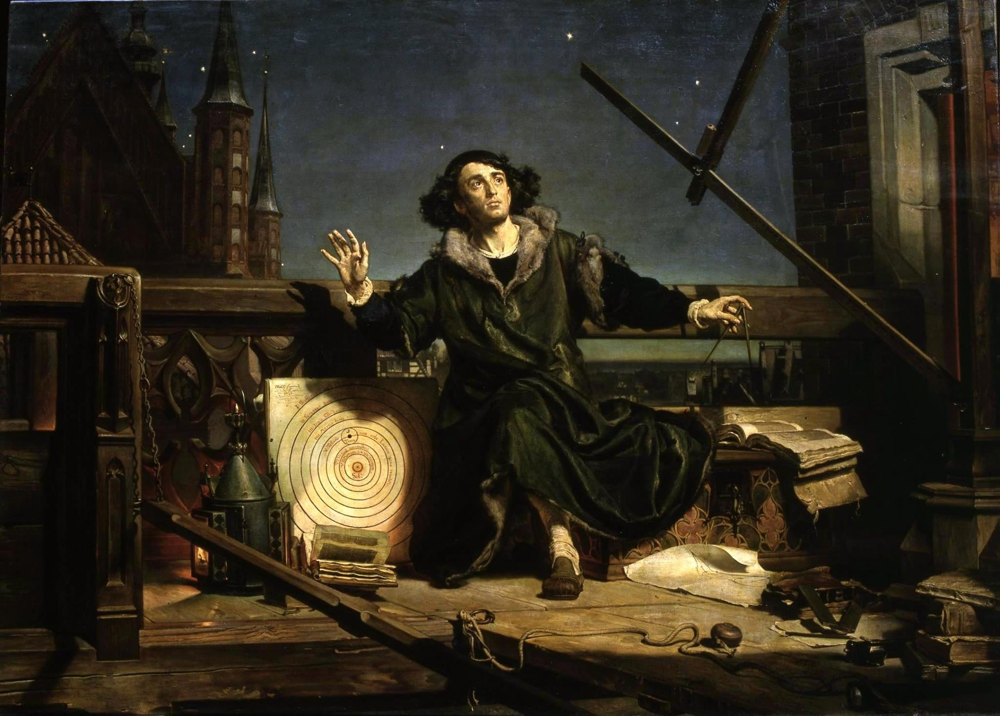
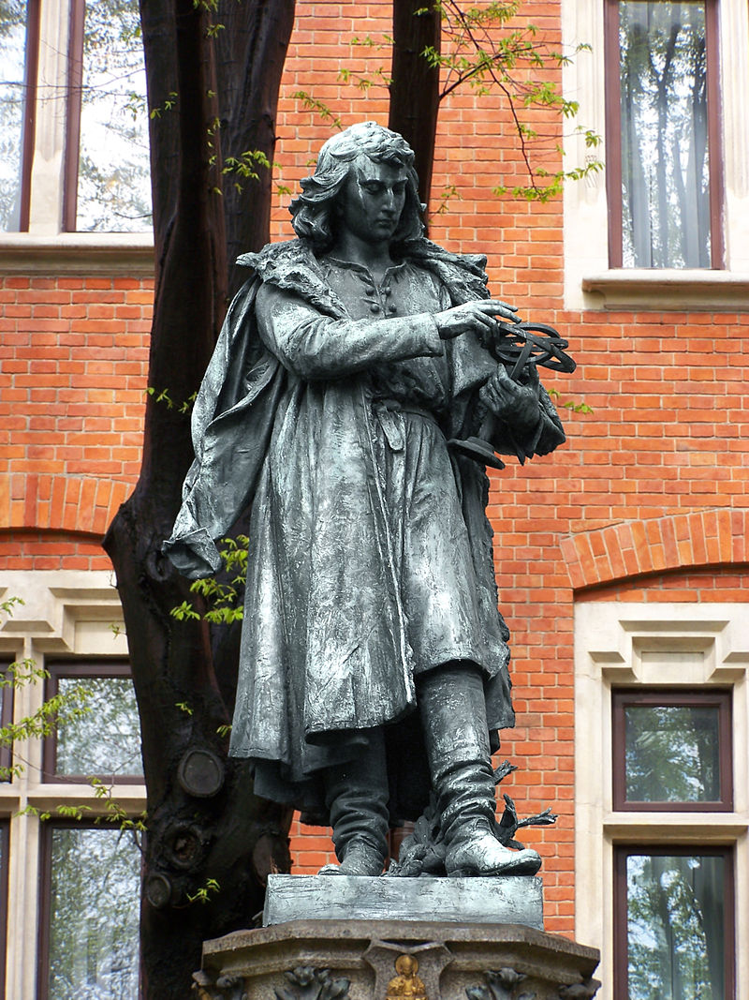

哥白尼小传：一个牧师献给教皇的书，颠覆了整个基督教

（万象历史特约作者：志哥画画）

【1543年5月24日】475年前的今天，用了20年，小心翼翼地提出日心说的哥白尼逝世

【艺术系的天文爱好者】

哥白尼，1473年2月19日出生于波兰小城托伦，父亲是以经营铜为生的富商。10岁时，父亲去世，他由舅舅照顾长大。他先后在圣约翰学校、弗沃茨瓦韦克的大教堂学校学习，是一名虔诚的天主教徒。

1492年（19岁），哥白尼进入波兰克拉科夫大学（今亚捷隆大学）读艺术系。这时，克拉科夫大学的天文学院正如日中天，哥白尼深受影响，成为一名天文爱好者。

大学毕业后，他赴意大利继续求学。1503年（30岁），获法学博士学位。

（画作《哥白尼与上帝对话》）

【20年才写成的日心说】

1506年（33岁），哥白尼回到波兰，给舅舅当秘书。1512年后（39岁），他开始在弗伦堡的牧师会长期任职。他在城堡西北角的箭楼，建了一座小型天文台。他使用自制的简陋仪器，开始天文观测。

（弗伦堡的哥白尼塔）

1514年（41岁），哥白尼在一篇四页的《短论》中，提到了日心说猜想。虽然得到了主教的鼓励，要他尽早正式出版。可是，哥白尼可能是害怕受到批评，一直没有这么做。直到20年后，大约在1536年（63岁），他才写成《天体运行论》，正式提出了日心说。

（《天体运行论》中哥白尼的宇宙观）

【献给教宗的《天体运行论》】

当时基督教会认为，地球是宇宙的中心。因为地心说很好地证明了《圣经》的观点：人类是特殊的，得到了上帝眷顾。哥白尼是牧师，他很清楚，日心说会给基督教轩然大波。因此，书写完后，并没有马上出版。

他非常小心翼翼。他在序中写明，书是献给教宗保禄三世的。然后，他又请来一位教士写前言。并且在前言中说，书中的理论只是猜想，并不一定是行星的真正运行规律。

1543年5月24日（70岁），垂危的哥白尼在病榻上见到了《天体运行论》样书。他摸了摸书的封面，便与世长辞了。 

（正式出版的《天体运行论》）

【被烧死的布鲁诺】

《天体运行论》其实是一本阅读体验极差的书。书中的观点模糊不清，一会儿说太阳位于宇宙的中心，一会又把太阳画在了旁边。也就是说，哥白尼并没有明确提出日心说。这本书出版后，几乎没有引起人们的注意。

1600年，布鲁诺在哥白尼的日心说基础上，提出了“无限宇宙论”，主张人类在宇宙中不是唯一的。这与《圣经》的解读起了严重冲突，于是布鲁诺被判火刑，在罗马被当众烧死。

这件事轰动一时，哥白尼的日心说开始受到更多人的关注。

（克拉科夫的哥白尼纪念碑）

【100多年的禁书】

这时，伽利略发明了望远镜，人们对天体的观测变得更加容易。越来越多的人，发现了日心说与《圣经》的冲突，进行激烈的争论。为了限制日心说，1616年，罗马教廷宣布把《天体运行论》列为禁书。

经过不懈努力，过了140多年后，1758年，天主教才从禁书目录去掉了对日心说相关著作的禁令。

这时，日心说早已深入人心。

（哥白尼墓碑）

（本文是万象历史·人物传记写作营的第33篇作品，营员“志哥画画”的第1篇作品）