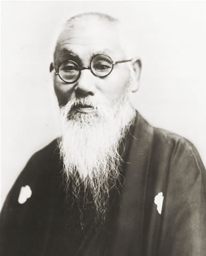
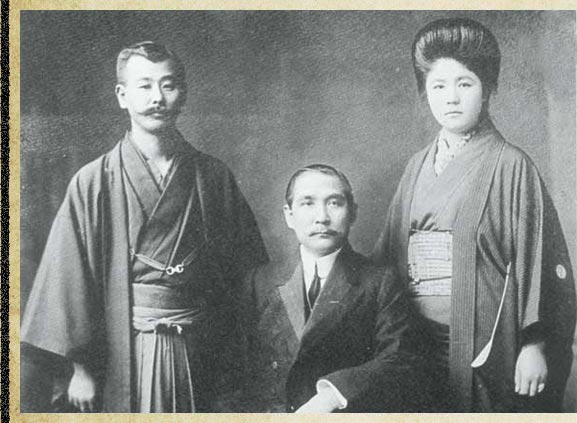
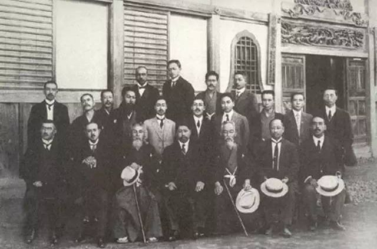
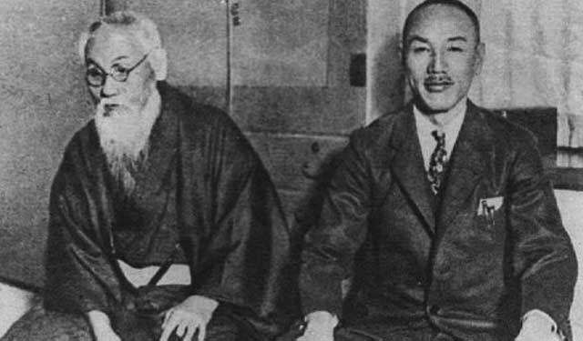

（万象特约作者：蓦然回首）

【1855年5月27日】头山满小传：日本黑龙会的幕后老大，支持孙中山革命的平民老人

【支持对外侵略的浪人】

1855年5月27日，头山满出生在日本福冈的一个破落武士家庭。明治维新后，日本政治有两派，一派是主张对外侵略的“征韩派”，另一派是主张先发展国内的“内治派”。两派斗争激烈。

1875年（20岁），头山满与平冈浩太郎等人，在福冈组织矫志社，拥护征韩派。第二年，矫志社密谋暗杀内治派首领——内务卿大久保利通。头山满等人因此被捕入狱，但不久就被释放。

1877年，在一场称为“西南战争”的大规模内战中，“征韩派”战败。头山满心情沮丧，但仍不甘心，继续暗中组织浪人团体。

（25岁的头山满）

【国家主义的玄洋社】

1881年（26岁），他与平冈浩太郎等人建立了日本第一个右翼政治团体——玄洋社（社长是平冈浩太郎）。玄洋社取日本海波涛澎湃、玄洋壮观之意，主张“大亚细亚主义”、国家民族主义。

玄洋社虽然是民间团体，人数最多时也只有500人，但成员中有相当一部分是政府官员和内阁成员，因此在政界影响力巨大。

1889年（34岁），外相大隈重信签订的条约中，包括允许外国法官的条款，引发争议。头山满派出社员来岛恒喜，刺杀大隈。大隈被炸弹炸去了一条腿，被迫辞职下野。而来岛恒喜随后自杀而死，反而成为大众心目中的英雄。玄洋社的势力令日本政坛震惊。

（孙中山与日本友人合影）

【支持同盟会的黑龙会】

1901年2月（46岁），头山满、内田良平等人在原玄洋社基础上，在东京组织成立黑龙会。黑龙会的目标是把俄罗斯赶出黑龙江，因此得名。黑龙会主张“日支一家”，要帮助汉族推翻满清统治，对付来自俄罗斯的威胁。

黑龙会大量资助中国推翻满清的革命运动。1905年7月30日，在黑龙会的斡旋下，中国的各派革命组织在东京黑龙会总部成立了中国同盟会。

（头山满和黄兴等人的合影）

【孙中山的亲密战友】

1911年（56岁），辛亥革命后，头山满、犬养毅等人，亲赴武昌、上海等地支援革命。因袁世凯不亲日，头山满等人到南京总统府拜访孙中山，主张北伐，反对南北议和。但最终孙中山同意南北和谈，头山满非常失望，败兴归国。

（头山满与孙中山的合影）

1913年，孙中山“二次革命”失败，被迫流亡。头山满疏通了国内关系，将孙中山接到东京，给安排好生活起居，并负责安全和对外联络。孙中山一直住到1915年8月，准备与宋庆龄结婚，才搬家离开。

孙中山对头山满感激不尽，回国后，两人保持密切来往，曾有多次会面。1925年3月，孙中山在北京病逝，头山满派人赴北京慰问悼念。1929年，民国政府举行安葬孙中山的奉安大典，头山满应邀来到南京，蒋介石亲自接待。

（1929年，到南京参加奉安大典的头山满（左），蒋介石站立在泥地中）

【山呼希特勒万岁的老人】

1931年（76岁），“九一八事变”后，满洲国成立，这并不符合黑龙会的意愿，头山满非常不满。1935年，溥仪曾邀请他访问满洲国，他以“没劲”为由予以拒绝。

1936年11月25日（81岁），由头山满发起，在日比谷公园召开日、德、意签订防共协定的庆祝会。会上，头山满亲自带头山呼：希特勒万岁！1941年，头山满让刀匠用黄金锻成大刀，赠给希特勒和墨索里尼。

（头山满与川岛芳子合影）

【平静安详的浪人老大】

头山满一辈子没有担任过任何官方职务，给人的印象只是个平凡的、留着长胡子的老人。事实上，他却是浪人的幕后老大，对日本政坛影响巨大。他慷慨好施，声望极高，又极其神秘和迷之深邃，许多桀傲不训的浪人，都死心塌地、为之效命。

（1927年，蒋介石访日期间与头山满合影）

他写了数部维新志士的传记，特别是“三舟”传记（胜海舟、高桥泥舟及山冈铁舟），是当时日本人人手一本的励志读物，极具影响力。

1944年10月5日，头山满逝世，葬于富士山，享年89岁。他被日本人认为是“最爱好和平人士”，实在是一位奇人！

（本文是万象历史·人物传记写作营的第34篇作品，营员“蓦然回首”的第6篇作品）