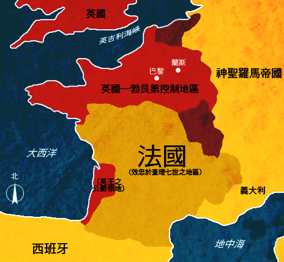
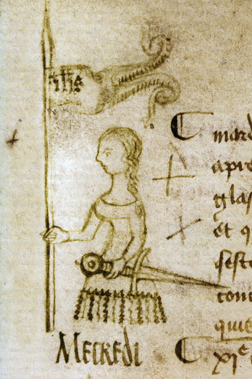
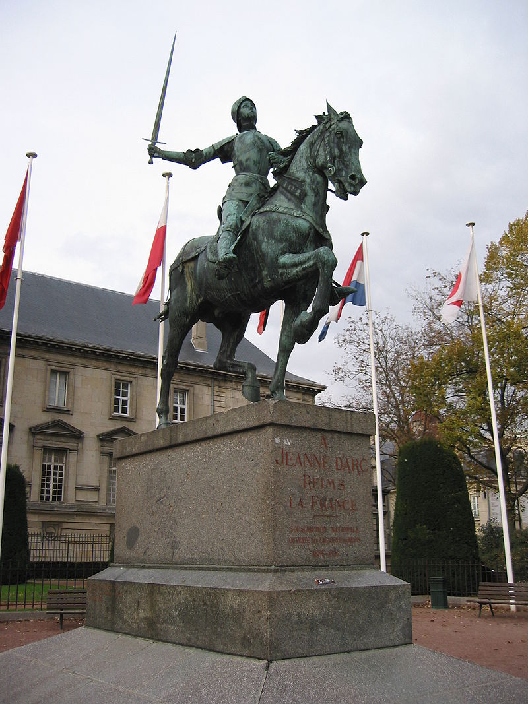

（万象特约作者：东西望）

【1431年5月30日】587年前的今天，大逆转百年战争的法国文盲少女贞德被烧死

【没有国王的法兰西】

1412年1月7日，贞德出生于法国农村，一生不识字。

当时是法国历史上最阴暗的时期，漫长的英法百年战争，让法国人饱受痛苦，北边的大片领土已被英格兰军队占领。国王查理六世患有精神病，完全无法处理政事，内部斗争激烈。王后又传出绯闻，并签下条约，承认英王是查理六世的继承人。

1422年，查理六世去世。英格兰占领了巴黎，并控制了北部城市兰斯。而兰斯是法国国王进行加冕典礼和祝圣仪式的传统地点。也就是说，到1429年，查理王子还没有进行加冕，还不是合法的国王。法兰西民族的存亡面临空前危机。

【见到神的农村少女】

贞德的出生地，位于法国东北部，是仍然忠于法国的一小块孤立地区。在贞德的童年中，村庄遭受了多次袭击。1924年，12岁的贞德第一次见到神迹，据称她遇见了3个大天使，告诉她要赶走英格兰人，并带领国王到兰斯进行加冕典礼。

16岁时，贞德请求亲戚带她到附近的驻防部队，跟指挥官说，希望能带她去见查理王子，结果遭到一番嘲笑。

第二年，贞德再次前来，她预言在奥尔良的法军会战败。当前线传来战败的消息，目瞪口呆的指挥官同意将她女扮男装，穿越广阔的敌方领土，去见查理王子。

【亲上战场的指挥官】

贞德见到王子，讲述了她的神迹，赢得了信任。这时，法国正在组织一场解救奥尔良的远征。贞德请求参加，穿上了骑士的装备。她自己没有钱，她的盔甲、马匹、剑、旗帜都是他人捐赠的。一年接一年的失败，法国军队的士气极其低落。大家宁可相信这位受到上帝指示的女孩，便让她来指挥军队。

1429年4月29日，贞德的军队到达战场，她大发雷霆，无视其他经验丰富的指挥官的计划，下令直接正面攻击英军。她随身带着一面鲜明的旗帜，投入到每一场小战斗中，身处最前线。

（1429年5月10日，在巴黎议会议定书边缘的涂鸦）

【不可思议的胜利】

令人不可思议的是，在她的率领下，法军士气高涨，赢得了一系列胜利，扭转了整场战争。仅仅一周后，法军攻下了奥尔良。

随后，贞德率领法军，不攻击近处的巴黎，而深入敌军领土进攻兰斯。法军长驱直入，所向无敌。1429年7月16日，法军攻入了兰斯。第二天一早，查理王子举行加冕典礼，正式加冕为查理七世。

（绘画《圣女贞德在查理七世的加冕典礼上》）

【上帝赐予的恩典】

9月8日，贞德率领法军进攻巴黎，战斗中被石弩击伤腿部，她跟往常一样继续指挥战斗。第二天，王室下令撤退。休整了一段时间后，1430年5月23日，在一场小规模战斗中，贞德被俘虏了。

1431年1月9日，在英格兰人的主导下，对贞德进行审判。法官问：“你是否觉得自己受到上帝的恩典？”贞德回答：“如果没有得到，希望上帝能赐予我；如果我已得到，希望上帝仍赐予我。”这个回答令所有人目瞪口呆。

因为这个问题其实是个陷阱。当时的教条是没有人可以肯定自己受到上帝的恩典，如果她做出肯定答复，那就证明她是异端邪说。

（审问贞德）

【火刑柱上的女装】

最后法庭总结了贞德的12项罪行指控，不识字的贞德签下了一份她完全看不懂的认罪书。认罪书声明同意，贞德可以穿着女性的服装。自从离开家乡以来，为了打仗方便，也为了防止意外的性骚扰，她始终穿着男装。

1431年5月30日，19岁的贞德被绑在火刑柱上，她不断地祈祷著，手握一个小十字架。最后火被点燃，几分钟后就结束了。

（火刑柱上的贞德）

【宣布无罪的处女】

1453年，20多年后，英法百年战争结束，法国获胜。在贞德母亲的请求下，法国宗教裁判所决定重新审判。

1455年11月，遵照标准的法庭程序，遍及欧洲各地的许多神职人员都参加了这场正式审判。到第二年7月，法庭宣布：她至死还是个处女，贞德是为正义而牺牲的圣女，无罪！

（巴黎大教堂内的圣女贞德塑像）

【西方世界的传说】

圣女贞德在接下来几百年里，成为了一个半传说的人物。她受到几乎所有人的喜爱，成为西方文化中的重要角色。尤其是在法国，几乎所有的政治派别都以圣女贞德作为他们宣传的旗帜。

1920年5月16日，贞德被封为圣人，她的纪念节日定在5月30日。

（兰斯的贞德像）

（本文是万象历史·人物传记写作营的第35篇作品，营员“东西望”的第10篇作品）

