（万象特约作者：东西望）

【1916年6月6日】102年前的今天，签二十一条、定国耻日、一生背尽黑锅的袁世凯离奇死亡

袁世凯作为篡夺革命成果，复辟当皇帝的“反面典型”，早已被钉死在了耻辱柱上。然而，或许有一天，他的故事将要重写。

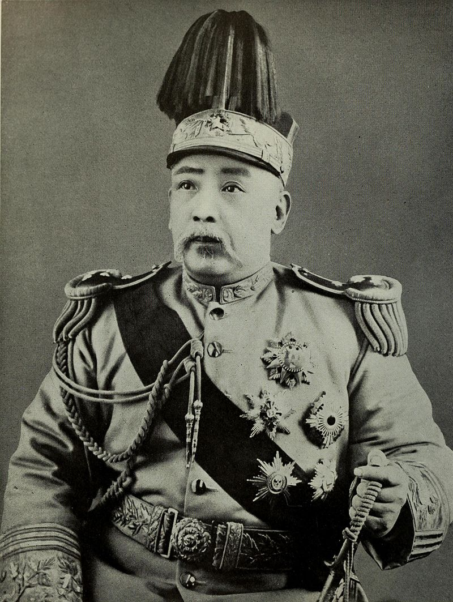

【克死亲人的扫把星？】

1859年9月16日，袁世凯出生于河南项城。袁家是地方名流，叔祖父袁甲三是淮军重要将领。袁世凯出生那天，正好收到袁甲三与捻军作战得胜的家信，因此取名叫“凯”。他出生后，过继给在淮军的堂叔为养子。

1873年（14岁），一个在京城做官的堂叔，回家探亲，把袁世凯带到北京念书。不久，养父和亲生父亲相继去世。

1878年（19岁），堂叔带着没有考上秀才的袁世凯前往河南开封赈灾。当时正值隆冬，大雪纷飞，袁世凯目睹饥民惨状，官军残杀，下决心“尽此赤心，捐此腐躯，上以报国，下以报叔父”。然而，灾区瘟疫横行，堂叔不幸染病去世，袁世凯只得返回家乡。

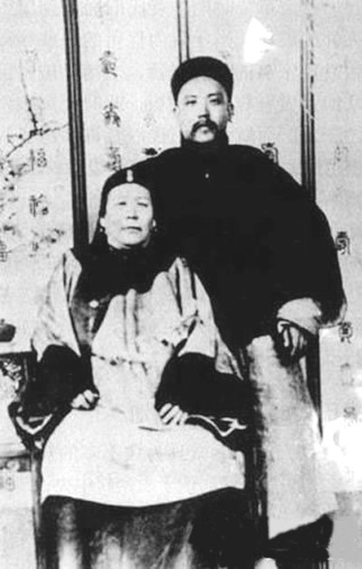

（袁世凯和母亲的合影）

【指点迷津的妓女】

袁世凯回到项城，一住三年。他乐于打抱不平，慷慨好施，广交朋友。他与后来当过总统的徐世昌相识，结拜金兰。他资助徐世昌兄弟，参加科举，双双考中举人。而他自己却再次落榜。

1880年（21岁），袁世凯打算另谋机会，来到上海。困顿之际，与妓女沈氏相交甚欢。沈氏阅人无数，得知袁世凯身世后，用私房钱资助他，劝他去投靠养父的结拜兄弟，在山东登州的淮军统领吴长庆。

后来，袁世凯发达后，没有忘记沈氏，把她接到朝鲜生活。沈氏终身未育，袁世凯还将次子袁克定过继给她为嗣子。

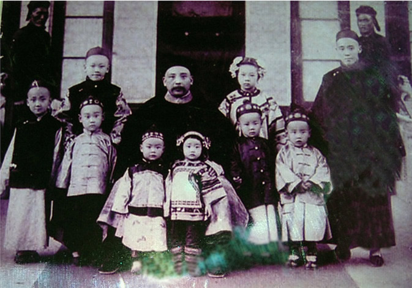

（袁世凯与儿女合影）

【朝鲜的“太上皇”】

1881年5月，袁世凯到了山东登州，吴长庆对他非常照顾。第二年，清朝的藩属国朝鲜发生兵变，袁世凯跟随吴长庆的部队前去平乱。之后，袁世凯以“通商大臣”身份留在朝鲜，帮助朝鲜训练新兵，并控制税务。

1884年（25岁），朝鲜发生了政变，驻朝日军试图干预，控制王室。袁世凯当机立断，指挥军队击退了日军，控制了局势。随后，袁世凯被封为驻朝鲜的全权代表，行使清朝的宗主权及其他特权。

10年后，1894年（35岁），朝鲜爆发东学党起义，形势紧张，朝鲜向中国请求出兵镇压，李鸿章同意了。日本也趁机出兵，双方发生摩擦，结果引发了中日甲午战争。

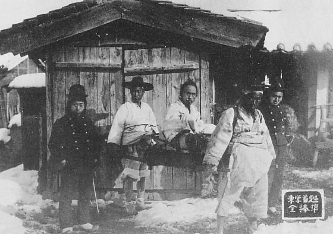

（1894年12月，被逮捕的东学党党魁全琫准）

【大帅在小站练兵】

中日甲午战争，清朝战败，袁世凯奉命撤退。李鸿章举荐他负责督练新军。他招募了2250名步兵，300名骑兵，再加上4750名定武军，在天津与塘沽之间的小站，开始了练兵生涯，史称“小站练兵”。

袁世凯以德军为蓝本，摒弃了八旗、绿营、湘军、淮军的旧制，制订了一整套近代陆军的完整制度。小站练兵培养了一大批近代新军事人才。袁世凯使用的《大帅练兵歌》，后来逐渐演变为解放军的《三大纪律八项注意》。

这支兵力后来成为清末陆军主力，也是北洋军阀的雏形。

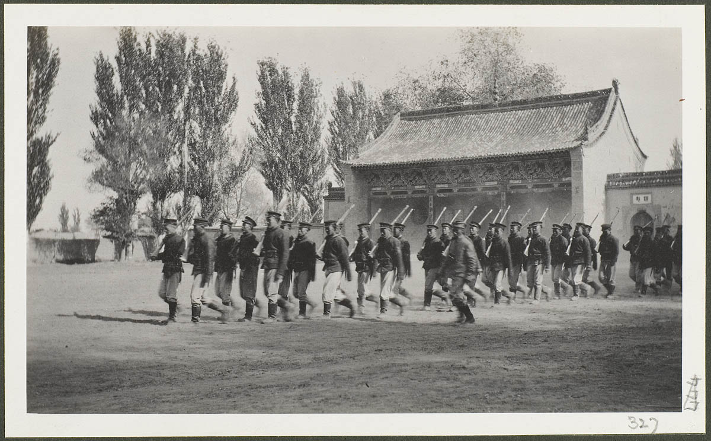

（新军操练场景）

【百日维新和义和团】

1898年（39岁），维新变法期间，手握重兵的袁世凯成为大家争夺的对象。他曾经资助康有为的强学会。

不久，百日维新失败，一般说法，说是袁世凯向荣禄高密所致。但现在越来越有证据表明，其实是由于维新派试图谋杀慈禧太后所致。袁世凯并没有主动告密，只是为了事后脱身，不得已向荣禄坦白。

1899年，山东义和团运动兴起，发生多起教案，袁世凯被任命为山东巡抚，前去控制局面。1900年，八国联军攻入北京，袁世凯控制下的山东政局最为稳定。而且，由于袁世凯加入了东南互保，不与列强宣战，使得列强没有扩大入侵范围的借口。

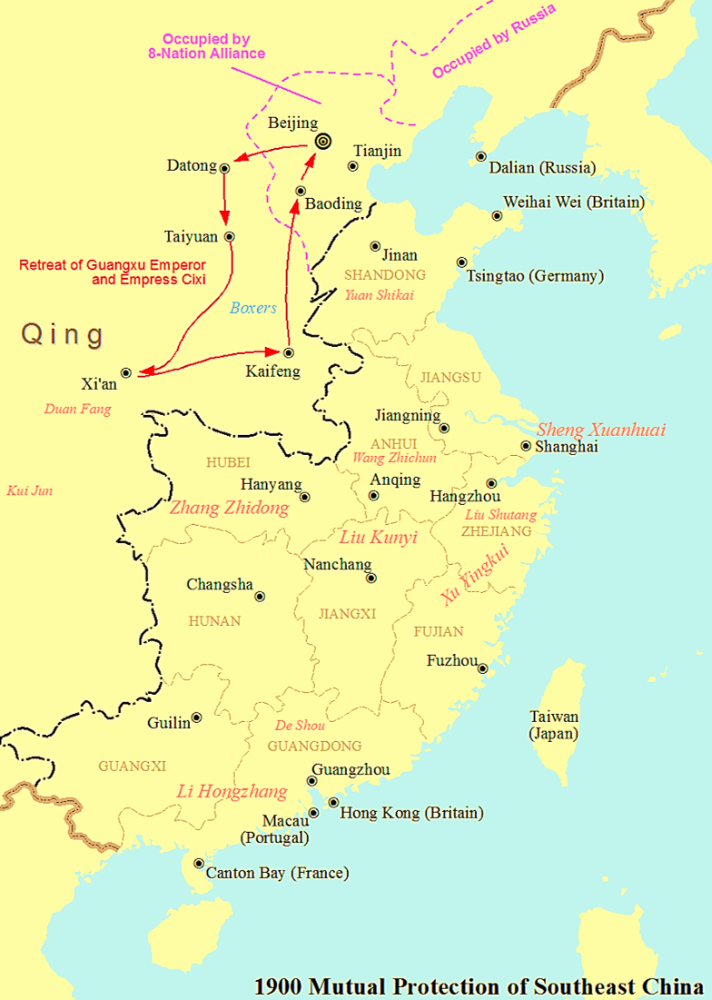

（1900年清末东南互保）

【建设天津的群臣之首】

1901年（42岁），李鸿章去世，袁世凯接任直隶总督，成为群臣之首。他顺利地从八国联军手中接手天津，并开始推行新政。他在海河以北建设天津的新城区——“河北新区”。这是中国第一个用西方现代城市规划理念建设的城市，初步奠定了天津的城市格局。

他建设了新火车站（今天津北站）、植物园、博物馆、新式学校、邮局、劝业会场（今中山公园）等等。他建设了北洋大学（今天津大学）、北洋军医学堂（今上海第二军医大学，台湾国防医学院前身）。

他建立了中国第一支新式警察队伍，第一个近代议会组织－天津议会，并试验地方选举、地方自治和司法独立等等。天津成为当时中国最现代化的城市之一。

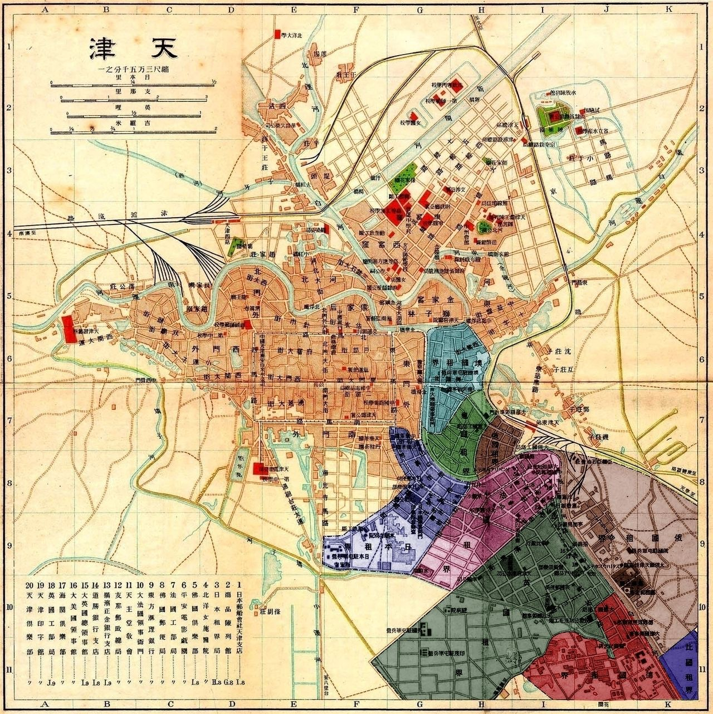

（兴建河北新区时的天津地图）

【隐居乡下的北洋军魁】

袁世凯以小站练兵为基础，在保定编练北洋常备军六镇，总兵数达7万人。1905年，在河间府举行河间秋操，这是中国第一次大规模现代化野战演习。第二年，又举行了彰德秋操。他邀请全国各地官员参观，震惊全国。

1906年9月，慈禧太后宣布预备立宪，袁世凯是这次政治改革的真正领导人。然而，改革方案出炉，因对满清亲贵不利，遭到反对。慈禧只得罢免袁世凯，改换其他大臣，最后制定出对满清官员有利的方案。

1908年（49岁），光绪帝、慈禧太后相继去世，溥仪继位，醇亲王载沣摄政。袁世凯遭到排挤，只得称病回到家乡。他隐居在今河南安阳洹上村，他韬光养晦，仍然留心政事。

视察京师大学堂译学馆，与该馆监督和学官大臣合影.jpg)

（1903年，袁世凯(中)视察京师大学堂译学馆）

【差点被炸死的议和】

1911年10月（52岁），武昌辛亥革命爆发，南方各省纷纷宣布独立。中外一致认为“非袁不能收拾局面”，袁世凯被起用为湖广总督，派兵南下镇压起义。11月，袁世凯任内阁总理大臣，谋求与革命党人议和。

12月，袁世凯和黎元洪各派代表，在上海就政体、清皇室善后、大总统等问题展开讨论，达成共识，无疑袁世凯将当选为民国首任总统。

孙中山领导的同盟会，不愿意接受，连夜在南京开会，成立了临时政府，孙中山任临时大总统。1月16日，袁世凯亲自上奏，劝隆裕太后退位，回家路上，遭到同盟会的炸弹暗杀，侍卫队死伤数十人，袁世凯幸免于难。

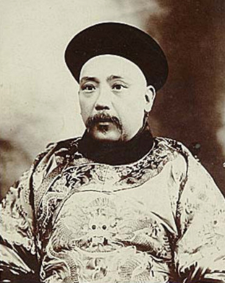

【同盟会内阁的制约】

为避免内战，袁世凯妥协，达成和谈。北洋军将领再次逼宫，2月12日，隆裕太后宣布，清帝退位，清朝统治宣告结束。

3月，袁世凯定都北京，成立北洋政府。孙中山制定了《中华民国临时约法》，变总统制为责任内阁制，制约袁世凯。由加入同盟会的唐绍仪组阁，同盟会多人进入总长之列，被称为同盟会中心内阁。

6月，唐绍仪任命新加入同盟会的王芝祥为直隶总督。袁世凯极为不满，不予承认，另行发布命令。唐绍仪愤而辞职。袁世凯提名由无党派的陆征祥组阁，遭到参议院反对。袁世凯便干脆任命赵秉钧代理。

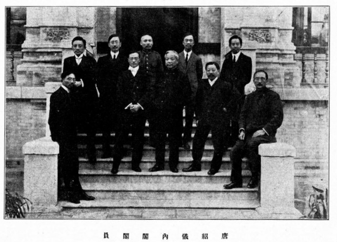

（唐绍仪内阁阁员，有4名同盟会成员）

【失败的二次革命】

1913年2月（54岁），在首次国会选举中，由同盟会改组的国民党，大获全胜，正常将由理事长宋教仁出任内阁总理。不料3月20日，宋教仁在上海被暗杀。时人普遍认为是袁世凯授意暗杀的，引发全国声讨。3月26日，孙中山抵达上海，与黄兴会晤，号召武力讨伐袁世凯，但遭到党内人士反对，经过3个月也未能组织起来。

4月26日，袁世凯未经国会同意，以全部盐税收入作为抵押，与英、法、德、日、俄五国银行团签订2500万英镑的“善后大借款”。风传该笔钱将用于北洋军对付国民党。后来，这笔钱民国政府一直还到1939年抗日时期。

7月，江西李烈钧宣布独立，组织讨袁军，“二次革命”爆发。随后，安徽、广东、福建、湖南、上海和重庆相继宣告独立。北洋军出兵讨伐，“二次革命”失败。孙中山等人逃亡日本，组建了对个人效忠的中华革命党。

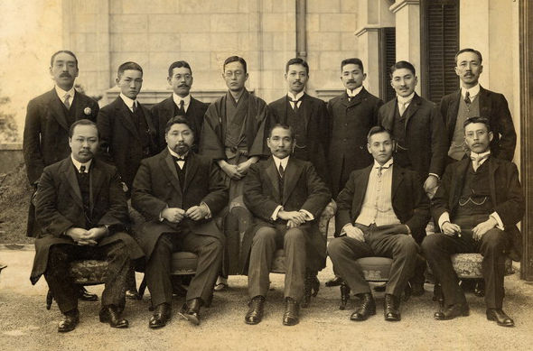

（二次革命期间，孙中山、黄兴等人合影）

【可以连任的大总统】

1913年10月6日，在中华民国大总统选举中，袁世凯以未达到法定3／4的票数，当选为正式大总统。随后，发布《天坛宪法草案》，要求国会扩大总统职权。国会不理会，予以拒绝。袁世凯向全国各省军民长官发出通电，各省回电均对袁世凯表示支持。

11月，发布《解散国民党通令》，取消国民党籍议员资格。1914年，将国会解散，公布《中华民国约法》，将责任内阁制改为总统制。公布《修正大总统选举法》，规定总统任期十年，可以连选连任。

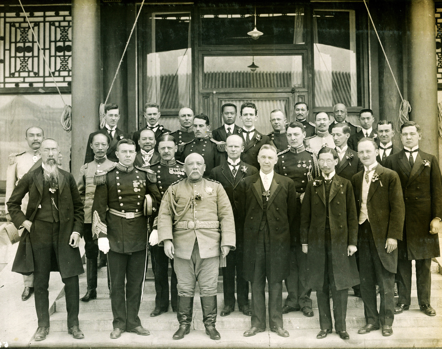

（1913年10月10日，袁世凯正式就任中华民国大总统之后，接见各国驻华使节）

【二十一条的国耻日】

1914年，第一次世界大战爆发，中国虽然是战胜国，日本占领德国在中国的势力范围。袁世凯两次要求日本撤军未果。

1915年2月2日，基于当年临时大总统孙中山与日本签订的、出卖主权的《中日合办汉冶萍借款合同》，日本趁欧美各国无暇东顾之际，向袁世凯提出了五号共计二十一个条款（简称《二十一条》）的无理要求。

到5月7日，历时105天，袁世凯政府与日方反复谈判20多次，删除了对中国最为不利的第五号要求。日本摆出要大战一场的姿态，军舰在渤海一带游弋，山东、奉天兵力增加，关东戒严，日侨纷纷回国。日本政府向袁世凯政府发出最后通牒，限5月9日下午6点前答复。

5月8日，袁世凯召集政府要员开会，接受日本条件，并宣布5月9日为中国国耻日，史称五九国耻。

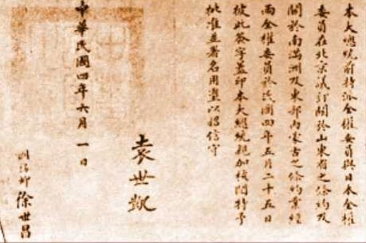

（袁世凯签名的《中日民四条约》，即《二十一条》）

【全票通过的君主立宪】

1915年，由于采用共和政体以来，一直乱象不断，舆论大多认为君主立宪制比共和制更适合中国。8月，支持君主立宪的筹安会成立，召集各省官员进京商讨国体，除少数表示拥护共和外，大都表示必须改变国体。

蔡锷第一个签字，代表北洋军人，请愿采取帝制。各地的请愿团也纷纷向参政院请愿，要求召开国民会议，票决国体。但以梁启超为首的共和派强烈反对，在他的帮助下，蔡锷逃离北京，东渡日本。

随后，依参政院起草的《国民代表大会组织法》，全国选出国民代表共计1993人。1915年12月11日，对国体变更问题投票，结果全票通过：采用君主立宪制。

【83天的中华帝国】

12月12日，袁世凯宣布次年为洪宪元年，即皇帝位。袁世凯拟定了《新皇室规范》：“……亲王、郡王可以为海陆军官，但不得组织政党，并担任重要政治官员；永废太监制度；永废宫女采选制度；永废各方进呈贡品制度；凡皇室亲属不得经营商业，与庶民争利……”

12月25日，蔡锷、唐继尧等人宣布云南独立，护国运动爆发。袁世凯组织北洋军征伐滇军，互有胜负。孙中山的中华革命党和日本趁机活动，支持反袁势力，战局变得复杂。

随着战势的加剧，人心不稳，黔、蜀、粤等省相继宣布独立。1916年3月18日，冯国璋联合5名将军发密电致各省将军，要求取消帝制。3月22日，袁世凯宣布君主立宪国体，退回各省区的推戴书，中华帝国宣告结束。

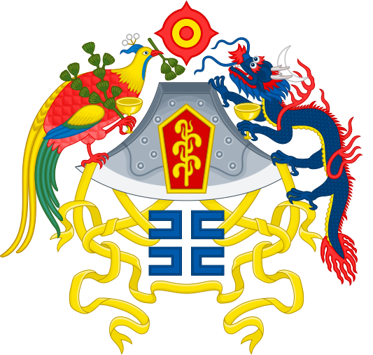

（袁世凯北洋政府时期，极具中国传统文化特色的国徽）

【为日本去一大敌的遗言】

袁世凯在《撤销帝制令》中申明：“盖在主张帝制者，本图巩固国基，然爱国非其道，转足以害国；其反对帝制者，亦为发抒政见，然断不至矫枉过正，危及国家，务各激发天良，捐除意见，同心协力，共济时艰，使我神州华裔，免同室操戈之祸，化乖戾为祥和。总之，万方有罪，在予一人！”

3月27日，袁世凯身体出现不适，声音嘶哑，疑系中毒。5月，病重，颜色憔悴，饮食锐减，不能入寐。6月，病情加重，饮食即吐，小便不通，不时猝晕。6月6日上午10时，袁世凯病逝。

据说，谢世之日，在书桌上留有他亲笔写下的一句话：“为日本去一大敌，看中国再造共和！”

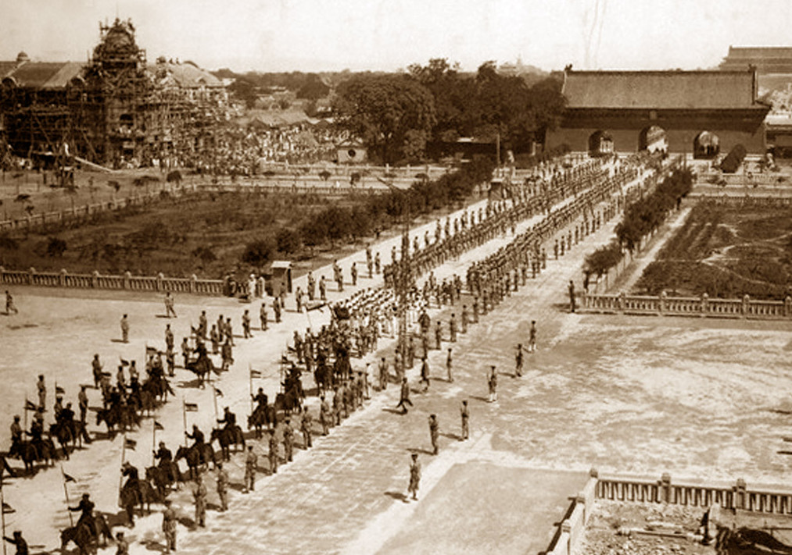

（1916年，为袁世凯举行国葬）

（本文是万象历史·人物传记写作营的第41篇作品，营员“东西望”的第11篇作品）