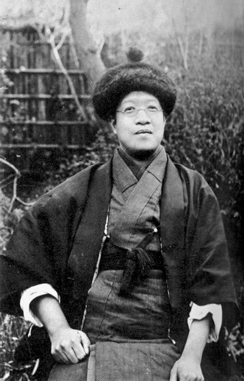
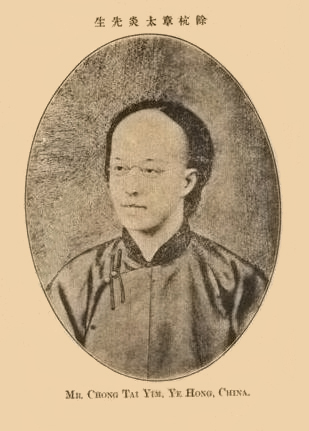
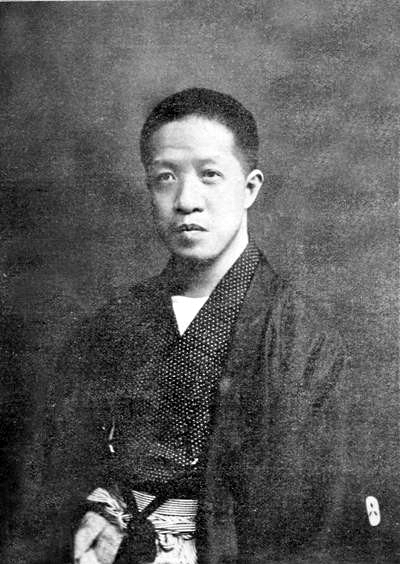
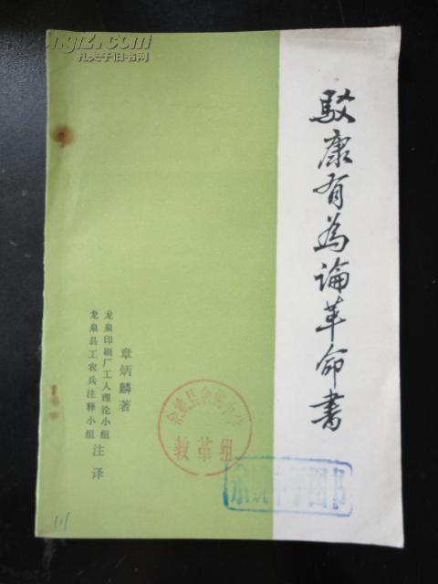
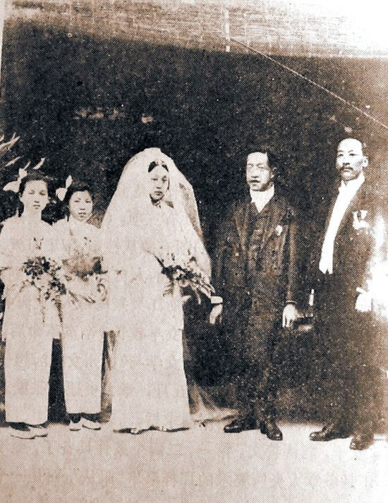
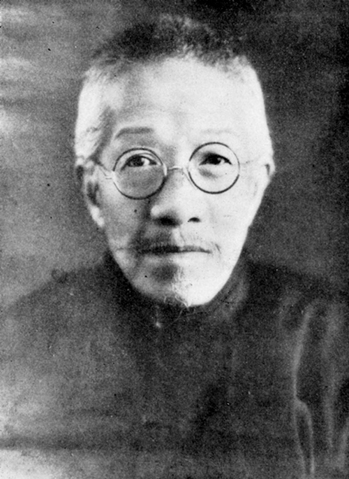

（万象特约作者：东西望）

【1936年6月14日】82年前的今天，至死不承认国民党政府的革命先驱章太炎逝世

【扇了梁启超一耳光】

1869年1月12日，章太炎出生于浙江余杭，家庭富有，是书香门第。幼年读《东华录》、《扬州十日记》等书，奠定了贯穿其一生的华夷观念。1891年（22岁），进入杭州诂经精舍，师从著名经学家俞樾、谭献等人，成为一位学识渊博的古文经学者、朴学大师。

1895年（26岁），中日甲午战争后，他捐款支持维新派强学会，与康有为、梁启超相识。不久，到上海维新派报纸《时务报》任主笔。但因不同意康有为的今文经学观点，与他的徒弟拳殴，并顺手扇了梁启超一耳光，只得离职回到老家。

【公开排满的《訄书》】

1898年（29岁），维新变法失败，章太炎仍然遭到通缉，只好逃到已割让给日本的台湾避难。第二年，他东渡日本，与梁启超等人修好。

1900年，他完成出版了著作《訄书》。訄（qiú），是逼迫的意思。《訄书》文笔古典、深奥，不易阅读，但公开提出了排满思想，公开批评孔子和儒学，反对“天道”观、“天命”论等。在当时，这如同晴天霹雳，在革命者中，产生了很大的影响。

同年，严复等人在上海组织“中国议会”，策划自立军起义，章太炎应邀参加。在会上，他当场割辫明志，反对光绪复辟。失败后，他再次逃亡日本，住在梁启超的《新民丛报》报馆中。他极力撮合孙中山的革命派与康梁的改良派。

【公然骂皇帝的苏报案】

1903年（34岁），他回到上海租界，加入了章士钊主笔的《苏报》。当时，康有为反对革命排满、主张立宪保皇，他认为有四个理由：一革命残酷，二国情特殊，三革命必然招致外国干涉，四皇帝圣仁。章太炎写下了著名的《驳康有为论革命书》，与邹容的《革命军》，同时在《苏报》上刊行，引起巨大反响。

文中，他公然点名批评光绪皇帝，“载湉小丑，不辨菽麦”。这八个字，如石破天惊，中外震动！在清政府强烈控告下，租界巡捕房逮捕了章太炎和邹容，判决入狱三年。这是自乾隆朝以后，清朝极为少见的一桩文字狱案件。

1906年（37岁），邹容病死狱中，章太炎三年监禁期满，出狱当晚，就坐船东渡日本。

【与同盟会的决裂】

他加入同盟会，任《民报》主笔，主持与梁启超《新民丛报》的论战。他主张“以国粹激励种性”，“以宗教发起热情”。他在东京开设国学讲习班，钱玄同、鲁迅、许寿裳、黄侃、陈寅恪等人都是他的学生。

1908年，有人公布了章太炎写给两江总督端方的信：“只要给两万元，便可舍弃革命宣传，赴印度出家。”章太炎无法辩驳，又因《民报》经费问题与孙中山等人产生矛盾，他黯然专心论学，著有《文始》、《新方言》、《国故论衡》、《齐物论释》等，开辟了汉语言文字学、经学、文学、及哲学心理学的现代化研究的先河。

1910年2月（41岁），章太炎、陶成章等人在东京重建光复会，章太炎任会长，正式与同盟会分裂。辛亥革命成功后，章太炎回到上海，组织了江浙地区的光复行动。孙中山就任临时大总统的第三天，章太炎即宣布脱离同盟会。然而，随着陶成章等人被刺杀，光复会解体了。

【第一个公开征婚的名人】

1912年（43岁），任袁世凯政府东三省筹边使。由于前妻病故多年，40多岁的章太炎公开刊登征婚启事：“人之娶妻当饭吃，我之娶妻当药用。两湖人甚佳，安徽人次之，最不适合者为北方女子，广东女子言语不通，如外国人，那是最不敢当的。”

1913年，经蔡元培介绍，与30岁的浙江人汤国梨结为夫妇。婚礼当天，章太炎过于兴奋，把皮鞋都左右穿反了。章太炎共育有四个女儿，都是古字命名，分别叫章㸚[lǐ]、章叕[zhuó]、章㠭[zhǎn]、章㗊[léi]。据说后来，因为不认识这几个字，都没人敢向她们提亲。

【大骂袁世凯的民国祢衡】

章太炎反对将孔教为国教，发表《驳建立孔教议》。新婚两个月后，就赶赴北京，去劝说袁世凯。袁世凯不见，他便以大勋章作扇坠，到新华门破口大骂，结果被袁世凯软禁在龙泉寺。

袁世凯称帝前，要他写“劝进书”。他断然拒绝，写道：“公今忽萌野心，妄僭天位，非惟民国之叛逆，亦且清室之罪人。某困处京师，生不如死！但冀公见我书，予以极刑，较当日死于满清恶官僚之手，尤有荣耀！”因此被时人称为“民国之祢衡”。

1916年6月，袁世凯死后，章太炎恢复自由，前往上海。

【至死不承认南京政府】

1917年3月（48岁），接受孙中山邀请，参加护法运动，任海陆军大元帅府秘书长，并为孙中山作《代拟大元帅就职宣言》。1918年，第一次护法运动失败后，他再次与孙中山决裂，不再支持护法运动，改为拥护联省自治，主要精力放在学术上。

1927年（58岁），南京国民政府成立后，章太炎坚持不承认、不合作，自称“中华民国遗民”，因此一度遭国民党通缉。

1936年6月14日，因鼻窦癌病逝于苏州，享年67岁。他留下遗言，只愿以五色旗覆盖棺木，不承认青天白日满地红旗。

（本文是万象历史·人物传记写作营的第48篇作品，营员“东西望”的第12篇作品）

