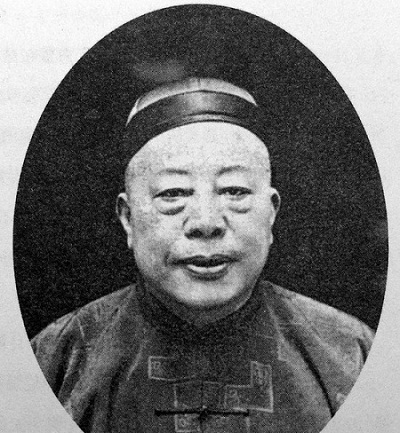
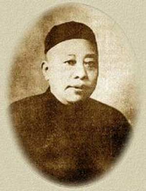
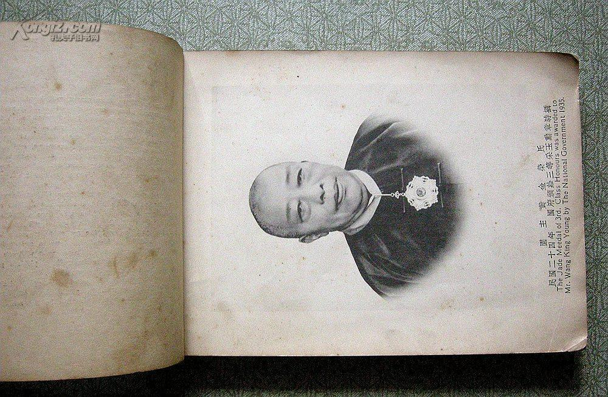
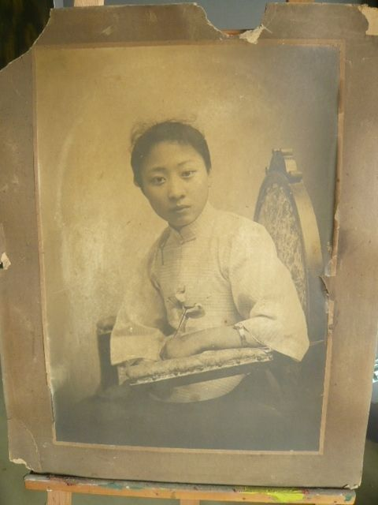
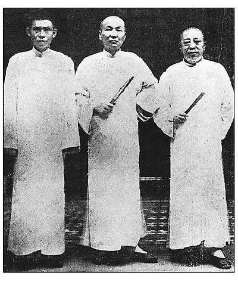
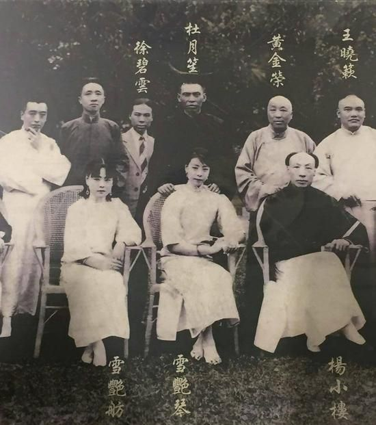
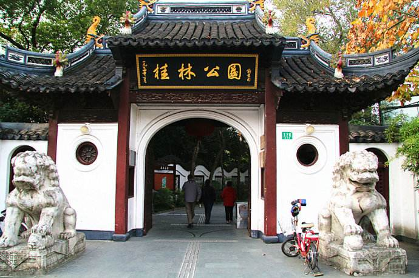
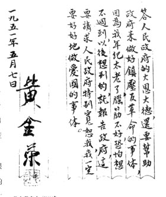
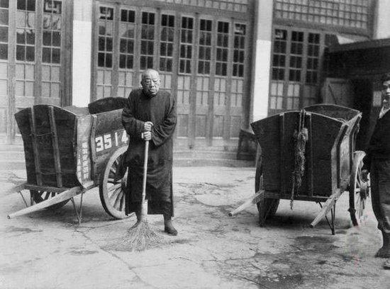

（万象特约作者：东西望）

【1953年6月20日】65年前的今天，蒋介石的老头子，上海头号大亨黄金荣黯然谢幕

【上海租界的小巡捕】

在旧上海的大亨里，排行第一的头号大亨，当推黄金荣。

1868年12月14日，黄金荣出生于苏州，幼年生活在上海漕河泾。16岁，在城隍庙的一家裱画店当学徒。1892年（24岁），考入上海法租界巡捕房当探员。他跟着法国巡捕，挨家挨户去征收“地皮捐”、“房屋捐”，还破获了几件大案。

【租界唯一的华人探长】

有一次，法国总领事的书记官偕同夫人去太湖游览，没想到竟遭到土匪绑架。法租界派黄金荣前往营救，他找到太湖土匪的头领“太保阿四”、“猪猡阿美”，轻而易举地将两人保释了出来。

还有一次，福建都督的参谋长带了六箱古玩、字画到上海来。不料，一出码头就被人偷走了。黄金荣负责追查，结果，不到半天就将原物如数追回。

他还侦破了一起法国天主教神父被绑架案。1917年（49岁），法国东正全权大臣授予黄金荣头等金质宝星，并提升他为唯一的华人探长，下配8名安南保镖。

【天字辈的青帮老大】

在巡捕房20多年，黄金荣行走黑白两道，手下有一帮小弟，成为地方一霸。他同时开设大世界、荣记大舞台、黄金大戏院、大观园浴室等，日进斗金。

“瓶中太满水须走，青叶红花白莲藕”，他也成为青帮的重要人物。尽管他没有拜老头子，没有开香堂，却自称为“天字辈”青帮老大。

（黄金荣捧红并娶入的老生露兰春）

【革命党人的保护伞】

1920年代，他与杜月笙、张啸林合伙经营三鑫公司，垄断了鸦片买卖，更加如日中天。“黄金荣爱钱，张啸林善打，杜月笙会做人”，三人合称为“上海三大亨”。

青帮是反满的，他也暗中支持保护革命党人，如孙中山、胡汉民、汪精卫等人都得到过他的庇护。1922年，在上海从事证券交易的蒋介石，拜他为老头子，寻求“保护”。

（上海三大亨：左起杜月笙、张啸林、黄金荣）

【蒋介石的帮凶】

1927年4月（59岁），国共合作破裂，蒋介石发动“清党”，黄金荣与杜月笙、张啸林组织中华共进会，帮助蒋介石一起对付共产党人和革命群众。

1928年，不久他从巡捕房退休，蒋介石任命他为国民政府少将参议、行政院参议。他的私人别墅黄家花园（今桂林公园），和杜月笙的杜公馆，堪称是上海最炙手可热的地方。1930年，蒋介石题字"文行忠信"，挂在黄家花园。

（1931年，杜月笙组织京剧名角盛大堂会后的合影）

【支援抗日的上海人】

1937年（69岁），抗日战争爆发后，黄金荣与杜月笙、张啸林等人，大力支援淞沪会战。上海沦陷后，黄金荣没有逃走，而是留在了上海，他装病，装疯卖傻，拒绝为日本人效力。

1945年，抗日战争胜利后，他组织成立青帮的分支帮会荣社，势力相当可观。

1949年（81岁），国共内战，上海战役国民党败退，黄金荣仍然没有逃走，留在了上海。

【无法重新做人的自白书】

1951年（83岁），黄金荣在《文汇报》和《新闻报》上刊登《自白书》，表示“愿向人民坦白悔过”，要“洗清个人污点，重新做人”，他在大世界门口扫马路的照片也公开登报发表，轰动一时。

结果却恰得其反，人民群众反响极其强烈，一封封控诉信、检举信，如雪片般飞进市政府，恳请政府作主，为民报仇雪恨，一时之间杀黄呼声响彻云天。

1953年6月20日，黄金荣在上海黄公馆谢幕人生，终年85岁。

（本文是万象历史·人物传记写作营的第52篇作品，营员“东西望”的第13篇作品）