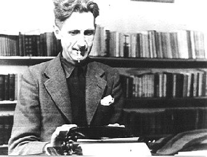
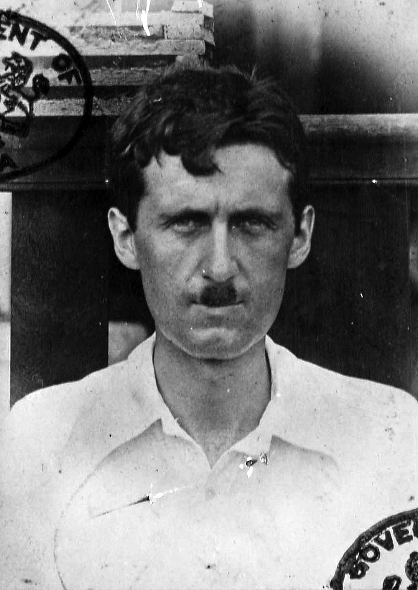
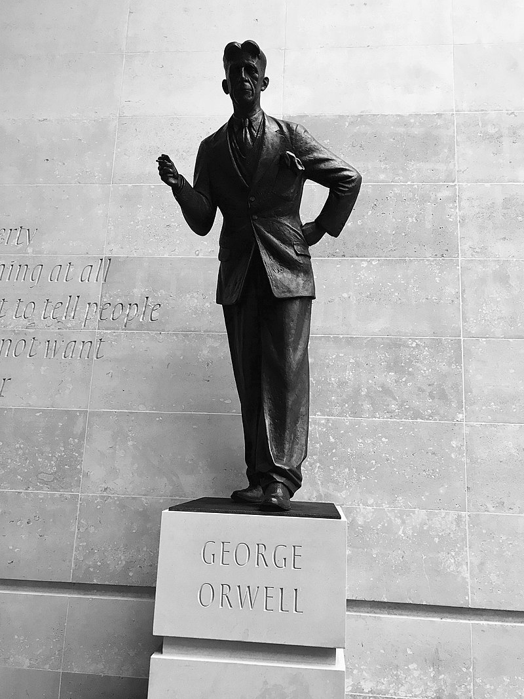
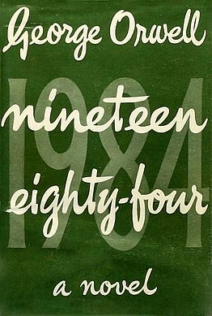
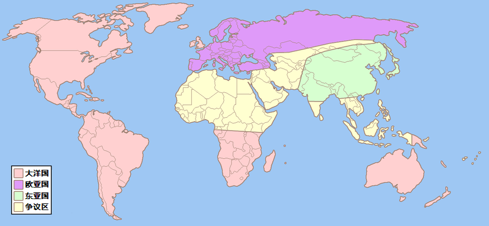
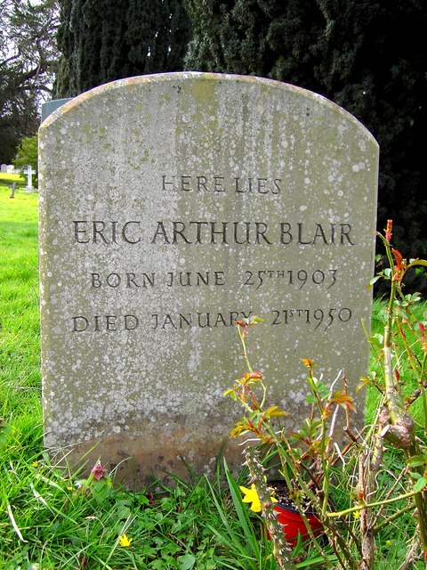
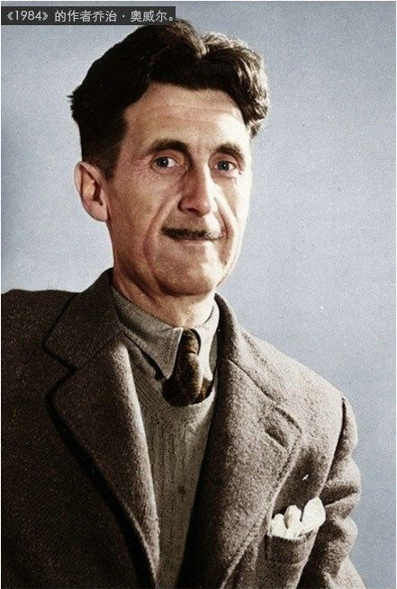

（万象特约作者：东西望）

【1903年6月25日】115年前的今天，《动物庄园》《一九八四》的作者奥威尔生于印度

【生于印度的英国人】

1903年6月25日，奥威尔出生于英属印度的一个政府低级官员家庭，家境并不宽裕。1905年，全家返回英国。由于无力就读贵族学校，1911年（8岁），奥威尔只能进入一个二流的私立寄宿学校读书。他开始体会到鞭子教育、等级制、恃强凌弱、规范化、反智等极权主义社会的特点。

他很早就展露了写作的才华，11岁时首次在地方报纸上发表一篇诗作《醒来吧，英国的小伙子们》。1917年（14岁），奥威尔依靠自己的努力考取奖学金，进入英国最著名的中学——伊顿公学，但穷学生的背景使他备受歧视。

【四处流浪的殖民警察】

1921年（18岁），从伊顿公学毕业后，他投考公务员，加入了英国在缅甸的殖民警察，服役五年。做为英籍警官，他享有很多特权，能够近距离观察审判、笞刑、监禁和绞死囚犯，细致地观察到人性中残暴的一面。

1927年（24岁），他离开殖民警察部队回到英国，开始了长达四年的流浪生活。他先后做过酒店洗碗工、教师、书店店员和码头工人，但他的上层社会身份和贵族口音，很难被底层社会真正接纳。贫困的生活和失败的感觉，使他痛恨社会不公，接受了社会主义思想。

（奥威尔在缅甸岁月期间的护照照片）

【支援西班牙的国际志愿者】

1933年（30岁），他以乔治·奥威尔的笔名发表第一部作品《巴黎与伦敦的落魄记》。此后，他先后出版了《缅甸岁月》等几部小说。1936年（33岁），他结婚了，以写作兼营杂货店为生。

同年，西班牙内战爆发。经独立工党介绍，奥威尔夫妇成为国际志愿者，参加了由西班牙共产党领导的共和军，支援反佛朗哥的西班牙内战。他在前线待了6个月，直到被狙击手打穿喉咙，回国休养。

【反对极权主义的“托派分子”】

在西班牙的这段时间里，他看到了国际纵队内部的权力斗争和清洗。接纳奥威尔的马克思主义统一工人党被共产国际认定为托派组织，斯大林下令予以消灭，顿时政治警察特务、搜捕异端及清洗专家蜂拥到西班牙，开始恐怖统治。

奥威尔夫妇被视为“狂热的托派分子”，受到严密的监控，房间被搜查，资料被抄走。更为可怕的是，奥威尔在受伤撤退后，还继续遭到追杀。

权力与支配无所不在，不容存在任何个人意志的斯大林式极权主义，让奥威尔极度反感。他说：“1936年以来，我所写的每一行严肃作品都是直接或间接反对极权主义，支持我所理解的民主的社会主义。”

（英国广播公司总部外的乔治·奥威尔雕像）

【冷战下的《动物庄园》】

1938年，他将在西班牙的经历写成《向加泰罗尼亚致敬》，揭露了共产国际一些关于西班牙内战的谎言，成为他的成名作之一。1939年，第二次世界大战全面爆发，他和妻子加入国防市民军，从事备战工作。1941年，受雇于BBC两年，从事有关战争的报道。

1944年，经历了西班牙内战和反法西斯战争的奥威尔写成了《动物庄园》一书。当时英国同苏联是盟友，出版商拒绝出版。1945年，二战结束，冷战开始，《动物庄园》才得以出版，获得了巨大的成功。

书中名言：“所有动物生来平等，但有些动物比其他动物更平等。”

【传世名著《一九八四》】
1948年，奥威尔写成了他的传世名著《一九八四》。在这部作品中，奥威尔描绘了一个极权主义达到顶峰的可怕的社会。它是反乌托邦科幻小说的经典，许多用语在英语中已普遍使用，例如老大哥、双重思想、犯罪思想、新话、101室、电幕、2+2=5、忘怀洞等等。

他写给朋友的信中说：“我并不相信我在书中所描述的社会必定会到来，但是，我相信某些与其相似的事情可能会发生。”

冷战时期，奥威尔的作品被视为反苏和反共的代名词，在苏联、东欧等社会主义国家遭到封杀。在中国，直到1985年才有简体中文版刊行，并被列为“内部读物”。2005年，本书被美国时代杂志评为最好的100本英文小说之一。2008年，泰晤士报评出英国50位最伟大的作家，奥威尔名列第二。

（一九八四中描述的世界版图）

【被监视一生的作家】

这本书耗尽了奥威尔的全部精力，出版后的第二年，奥威尔就因肺结核去世了。墓碑上简单地刻着：“艾瑞克·亚瑟·布莱尔，生于1903年6月25日，卒于1950年1月21日。”没有提及他那著名的笔名。

根据2007年英国国家档案馆解密的资料，因被怀疑是共产主义者的关系，奥威尔被军情五处和伦敦警察厅特别科自1929年起一直严密监视直至逝世。

（本文是万象历史·人物传记写作营的第56篇作品，营员“东西望”的第14篇作品）

