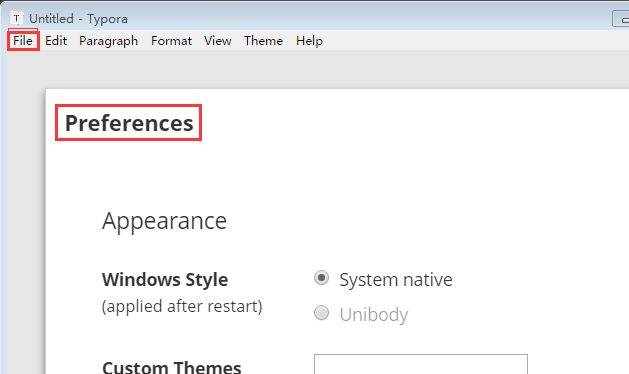
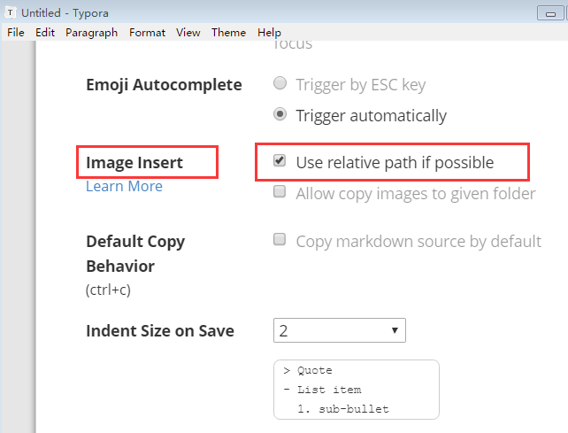

# Typora安装使用指南

1. Typora简介

   Typora是所见即所得 WYSIWYG（What You See Is What You Get）的MarkDown编辑器。让 Markdown 写作更简单，免费极简编辑器

   [官网下载链接https://typora.io/](https://typora.io/)

   支持Mac、Windows、Linux

2. 安装

   下载后正常安装，即可。

3. 设置

   ⭐️ 设置图片使用相对路径

   

   

   ​

   mac版，有相同设置。

   ​

4. 写文章时使用

   第1步：创建文件夹

   第2步：创建Typora文件，并保存到文件夹中（文件后缀为md）

   第3步：写文章；下载相关图片到文件夹中

   第4步：将图片直接拖拽到文章的相应位置

   第5步：文章写完后，将整个文件夹打包成zip包发送

   ​