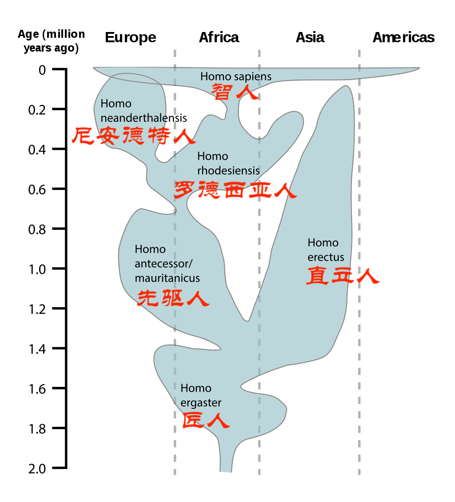

第1集、人就是动物丨写给中小学生的《人类简史》

很多人都同意，人是动物。同时往往要加一个形容词，人是“独一无二”的动物。

但这个词，加错了。人毫不特别，只是一种普普通通的动物而已！

大约135亿年前，宇宙大爆炸。物质、能量、时间、空间等得以产生，这便是“物理学”。

宇宙大爆炸后大约30万年里，物质和能量形成了复杂的原子或分子。他们之间的互动，便是“化学”。

大约38亿年前，在一个叫地球的行星上，一些分子结合起来，形成庞大而精细的“有机体”，便是“生物学”。

大约7万年前，一个叫“智人”的物种，创造出了更复杂的架构，称为“文化”。人类文化的变化发展，便是“历史学”。

“智人”的历史，主要经历了三次重大的革命。

1、大约7万年前，“认知革命”让历史开始启动

2、大约1万2千年前，“农业革命”让历史加速发展

3、大约500年前，“科学革命”让历史开创新局面，或者画下句点。

《人类简史》主要就是讲述，这三大革命如何改变了“智人”和其他生物。

你一定注意到了，我用的词是“智人”，而不是“人类”。因为这是两个完全不同的概念。

生物学上，把不同的生物划分为“物种”。所谓同一“物种”，就是彼此交配，能够不断繁衍下一代，拥有物种独有的DNA库。

比如，马和驴，虽然杂交能生出骡子，但无法继续繁殖，两者的DNA不会混杂，因此是不同的物种。

比如，现在全球的人，不管白种人、黑种人、黄种人，都可以正常繁衍下一代，因此是相同的物种。这个物种，就叫“智人”。

由同一个祖先演化而来的不同物种，称为“属”。通常意义上的“人类”是指“人属”。

“人属”包含很多人种。

1、250万—200万年前，生活在东非的“能人”，由南方猿人分支出来。

2、180万—140万年前，生活在东非、南非的“匠人”

3、170万—30万年前，生活在中国的“直立人”，最典型的是“北京人”

4、20万—3万年前，生活在中东、欧洲的“尼安德特人”

5、4万年前，生活在西伯利亚的“丹尼索瓦人”

6、15万年前至今，遍布全地球的“智人”

等等，目前已知共有10几种。

但是，现在这些人种都已经全部消失，只剩下“智人”这一个物种了。

这些消失的人种，是我们“智人”的祖先吗？

通过DNA检测发现，现代智人有1%—4%的尼安德特人DNA。

这一方面说明，尼安德特人与智人之间的差异，并没有大到完全生殖隔离的程度。另一方面也说明，这两种人几乎没有延续关系。

也就是说，现在的中国“智人”，并不是“北京人”（直立人）的后代。

这些人种为什么消失了？

越来越多的证据表明，很可能就是被智人赶尽杀绝了。下一章，我们再细讨论。

在“人属”之上，还有“人科”，也叫“猩猩科”。

“猩猩科”，自然包含了各种猩猩，其中黑猩猩是与“人属”关系最近的生物。

国际自然保护联盟的分类中，所有“人科”生物，除了“智人”，其他都属于“濒危物种”或“近危物种”。

人类与其他动物相比有什么不同？

最显著的特征是，人类拥有一颗“巨大”的脑袋，有着超乎寻常的脑容量！

对于60公斤的哺乳动物，平均脑容量是200立方厘米。然而，早在250万年前的人类，脑容量已经达到了600立方厘米。现代智人的脑容量更是达到1200—1400立方厘米。

你或许会骄傲地认为，“智人”是脑容量最大的物种，所以最聪明，所以能“无敌于天下”。

但是，并不是这样。

尼安德特人的脑容量能达到1200—1750立方厘米，比智人更大。

人类拥有一颗“巨大”的脑袋，很难说是有利，还是有弊。

大脑虽然只占体重的2%—3%，但即便在休息时，也要消耗25%的能量。

这样，供给肌肉的能量就减少了。所以，人类的力气，与其他哺乳动物相比，简直就是“弱鸡”，不堪一击。

直立行走也是人类的一大特点。

为什么要直立行走呢？恐怕就是为了能更好地支撑一个“巨大”的脑袋。

直立行走解放了双手。

双手就可以做很多其他的事。手就越来越精细，能够制作、使用工具。

250万年前最早的人类，就已经会制作工具了。

你绝不要以为，会使用工具的人类，就无敌了。事实上，那时的人类仍然是“弱鸡”，只能在豺狼虎豹的夹缝中生存。

在石器时代，人类使用石头，最主要的目的，其实是砸烂骨头，吸食骨髓。

这当然是，肉已经被其他动物吃光了，留下来的“狗剩”。

人类需要大量肉食，给“巨大”的脑袋供养能量。

可“弱鸡”的人类手无缚鸡之力，如何能击败肌肉发达的野蛮动物，吃到珍贵的肉呢？

只有一个办法，热死它们！

通过不断地追逐，让动物不停奔跑，体内的热量来不及散发，体温越来越高，最终发了“高烧”，体内环境失衡，而轰然倒下。

人类是生物界罕见的“无毛”动物，而且全皮肤都可以出汗散热。人类跟其他动物比散热，拥有无可匹敌的优势。

就像马拉松宣称的那样，人类天生就是擅于长跑的动物！

人类“巨大”的脑袋，给要生孩子的女性带来了巨大的困难。尤其，直立行走后，臀部变小，产道变窄了。

解决的办法是——早产！

即便是“早产”，婴儿的头部依然很大，女性要承受巨大的痛苦，甚至面临死亡的风险。

“早产”的婴儿，同样也随时面临死亡的风险。大部分人类，会在婴幼儿期死亡。

婴幼儿死亡率的大幅降低，只是近代的事。

而且，由于是“早产”，婴儿尚未充足发育，就生出来了。他睁不开眼，不会说话，不会走路，甚至连吃东西都有困难。

而刚出生的小牛，很快就可以跟在“妈妈”身旁，自食其力了。

为了养育柔弱的早产儿，妈妈需要用更长的时间喂养。因此，人类的女性拥有和身材不太匹配的硕大乳房。

“早产儿”需要经过数年的精心照料，才能长大成人。女性为此需要付出巨大的代价，也使得女性，在其他许多方面，与男性相比，处于劣势。

这就是为什么，地球上所有文明，即使相互独立，互不干扰，最终都不约而同，发展成了“男权”社会。

人类还有一个显著的特点，就是会用火。

大约在80万年前，人类已经会用火了。到30万年前，用火就已经是家常便饭了。

火带来的好处很多，可以烧毁森林，可以驱赶野兽，但最主要是改变了食物。

首先，能吃的东西更多了。比如，小麦、水稻、马铃薯等，原来不能吃的，现在能吃了，甚至成为我们的主食。

其次，食物中的病菌和寄生虫会被杀死，生病的可能性大幅降低。

还有，进食的时间，消化的时间，都能大幅缩减。

食物的充足和易消化，使得尼安德特人和智人，能够供养一颗更大的脑袋。

人类能够用火的时候，可以说是控制了一项既听话而又有无穷力量的工具。

但人类依然是“弱鸡”，直到15万年前，所有的人加起来仍然不足百万。对整个地球而言，根本微不足道，只是一种边缘生物。

从7万年前开始，“智人”突然崛起，席卷了整个地球，这又是怎么回事呢？

