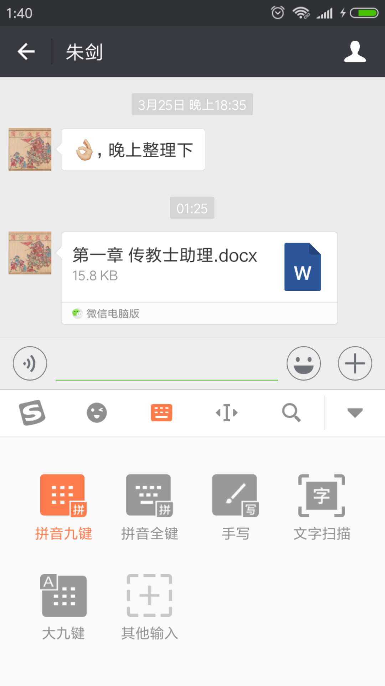
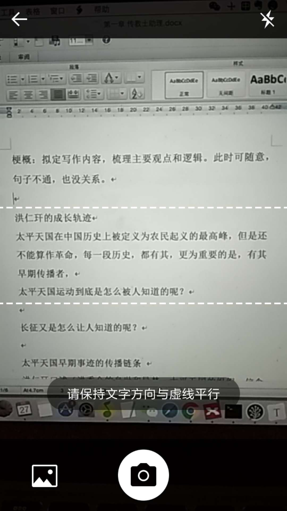
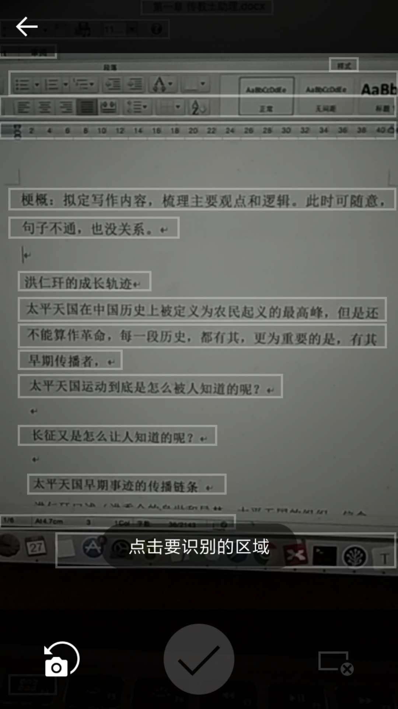
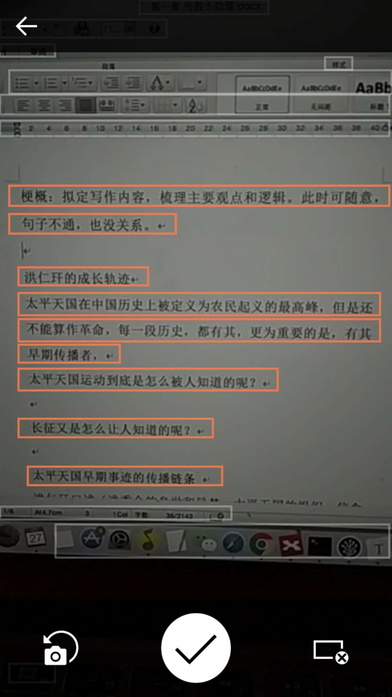
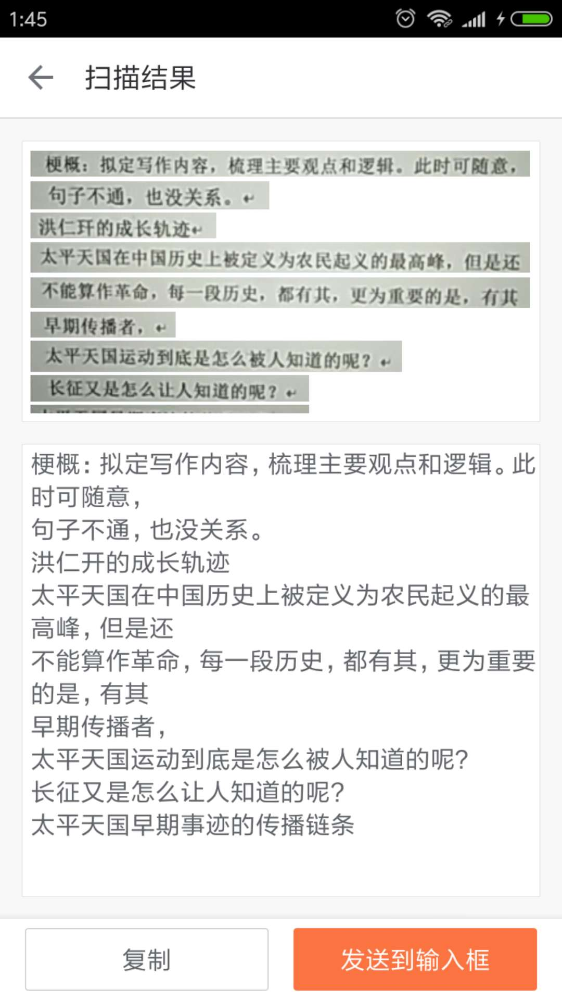

如何用手机快速输入书本上的文字？

1、下载 搜狗输入法，并设置为当前输入法

2、在记事本、微信等任何输入框，启动搜狗输入法

3、点击“文字扫描”

4、点击“拍照”按钮

5、手指按住屏幕下拉，选中要识别的文字框

6、点击“✔️”按钮

7、检查识别正确率，如满意，点击“发送到输入框”。如不满意，退回重新拍照

8、全部识别后，传到电脑进行校对

该方法可以快速输入文字内容。可用来制作电子书。