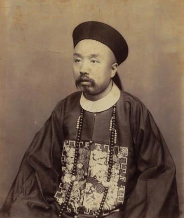
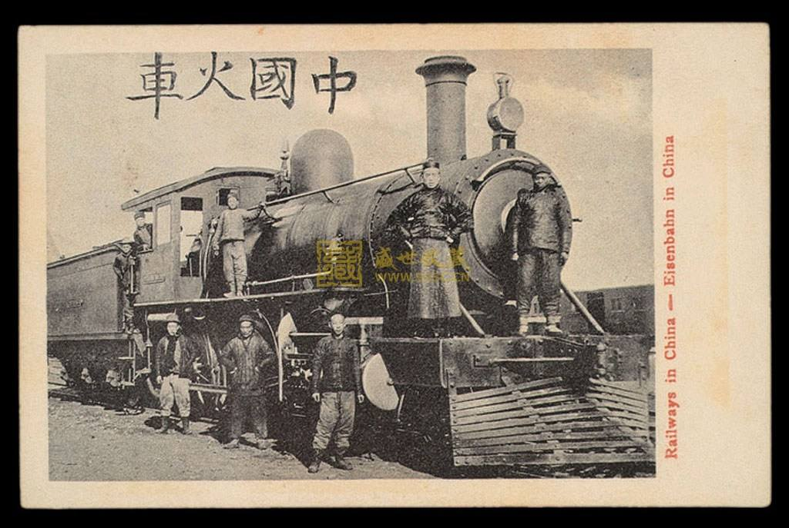
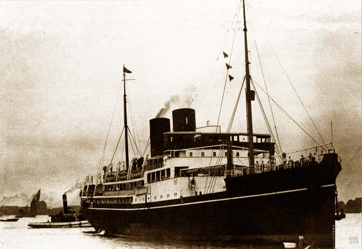
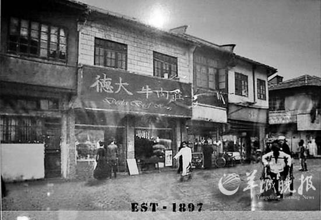
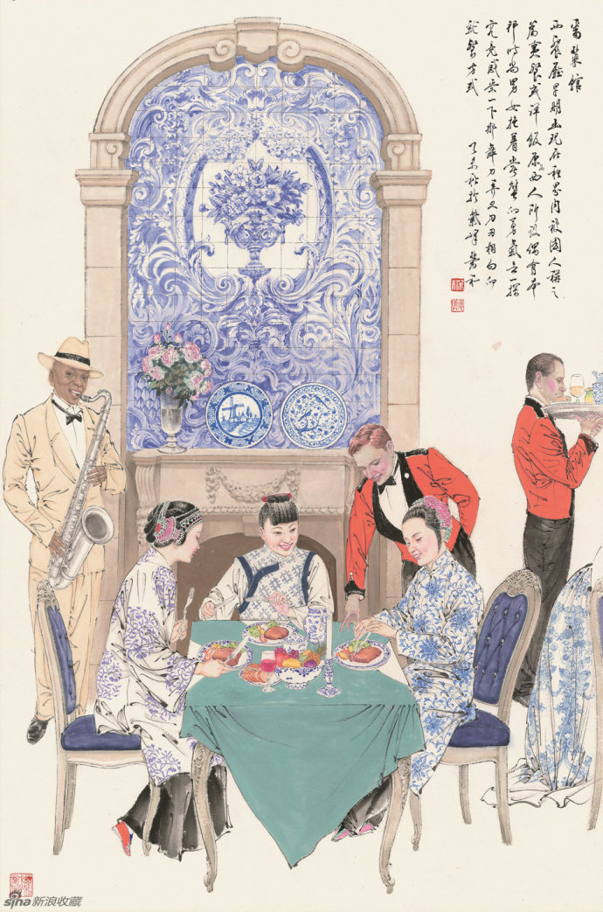
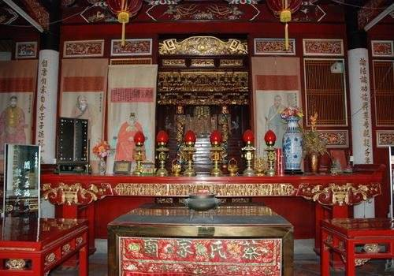
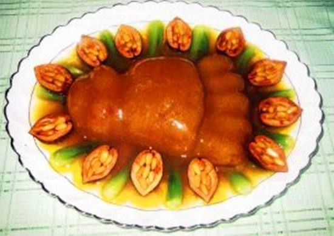
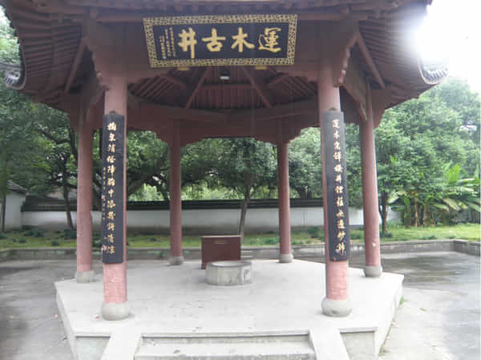
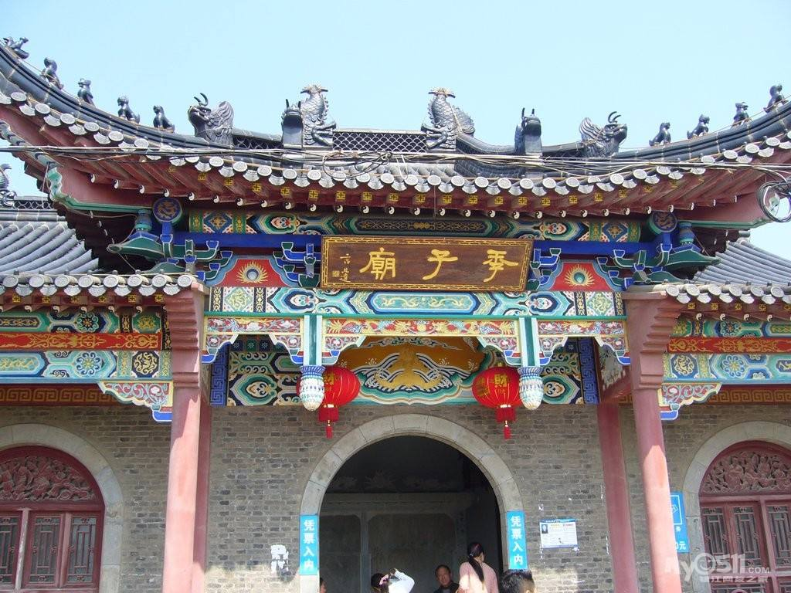
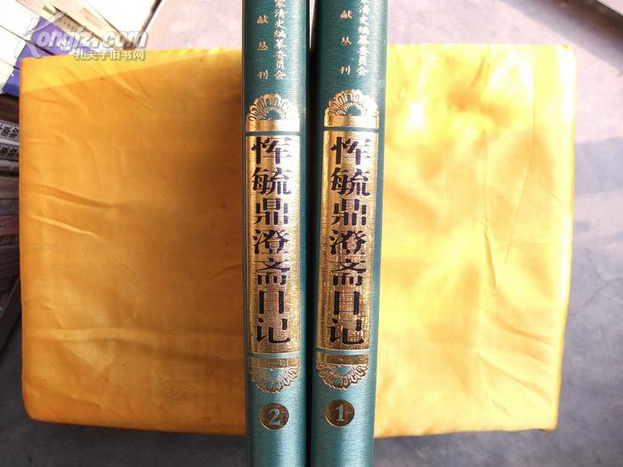

标题1：100年前，一个清朝公务员自助旅行的“腐败”报告

标题2：100年前，一个清朝老“驴友”的南方自助游攻略大全

（万象历史特约作者：顾亚欣）

（恽毓鼎像）

我叫恽毓鼎[yùn yù dǐng]，是清朝光绪年间国史馆的公务员。听说，在现代有一个叫“驴友”的词，指自助旅行的爱好者。你或许觉得，“驴友”应该是在现代社会才出现的新潮人群吧？如果你这样想，那真是少见多怪啦！因为我们这时候，根本就没有旅行社，只要出门，就全靠自己搞定一切，百分百的自助游，你想不当“驴友”都不行咧。

而且，出一趟门短则个把月，长则几年，比你们这些“驴友”不知辛苦到哪里去了。幸好，我也有苦中作乐的“驴友”心态。我前后做了19年的史官，写点文字，那是本职工作。顺手将旅途中的见闻记下来，回头再慢慢品味，乐在其中。今天就给大家分享我的一次旅行攻略吧。

那是在1899年，那年我37岁。从北京出发，目的地是江苏常州。我是土生土长的北京人，为什么要去常州呢？很简单，因为我的爷爷是常州人。我爷爷考上进士后，走南闯北，到全国各地当官，最后落户北京。虽然，我从没见过他，在我出生的两年前，他就去世了，但父母还经常会提起他。常州是我的老家，这段时间正好有空，就打算去看看。

（江南水乡常州府）

**1、犀利的新式交通**

这次行程，是先到上海，再回常州。为什么要先去上海呢？一个原因是，上海通轮船，这是最快的路了。另一个原因是，上海有很多洋人，是最新潮的城市，我很想去看看热闹，开开眼界。回来就可以给同事吹吹牛了！

1899年9月6日上午11点，我从北京坐上火车。下午3点，到了天津，然后第二天上午10点上轮船，13号到上海。算起来，从北京到上海一共花了7天。听说你们能坐一种“大鸟”飞过去，只要两个多小时。我可不敢想，万一没坐稳掉下去可怎么办？

7天已经很快了，我很满意。火车和轮船都是最新式的交通工具，比以前不知快到哪里去了！为什么不坐火车直接到上海呢？你开玩笑吧？到天津的这一小截火车，还是前几年才开通的，别地方还没听说过呢。

假如没有火车或者轮船，那就慢得多啦。比如17年前（1882年），那时北京到天津之间还没有铁路，害我整整走了2天。后来，我还去河南开封出差。从保定到开封，步行了15天，把我累得够呛。

我这还算好的。41年前（1858年），翁同龢大人从北京到西安，全程“11路”，一共花了26天。这么一比较，你说我能不满意吗？而且火车和轮船比坐马车舒服多了。以前出门坐车或者骑马，一路那个颠啊！吃点什么全给你晃荡出来了。所以，面对这新式交通工具，不得不赞一声“犀利”。

（火轮船）

**2、西餐厅里好开心**

到了上海，最主要是开洋荤。开什么洋荤？就是吃西餐啦！很多人都搞不清楚吃西餐的规矩。吃个饭竟然还要动刀子？为什么不用筷子呢？开洋荤一不小心就变成了出洋相啦。

最好玩的是冰淇淋，冒着烟，心想肯定烫得不得了，用嘴吹啊吹啊，半天都不敢吃。吃了一口，妈呀，竟然是冰凉的。听说，还有人把洗手用的水，当白开水给喝掉了。当然，我还不至于这么没见识，毕竟也是京城的公务员嘛。西餐馆偶尔也会下下，白兰地和啤酒有时也会喝两口，不过味道怪怪的，还是不如老白干带劲。

（上海最早的西餐馆德大牛肉庄）

9月13号，一到上海，就去西餐馆大吃了一顿。接下来两天，每天都出去吃。据说，外号“长毛状元”，曾经给太平天国献策的王韬，就经常在西餐馆存上一笔钱，不时请朋友来大吃一顿。我当然没机会和他吃饭了，两年前他已经去世了。

虽然吃西餐，也算是家常便饭，但西餐里真正的好菜，像什么鹅肝、黑松露、菲力牛排啊什么的，我基本没吃过。吃得比较多的是像蘑菇鸡肉卷、葡国鸡、土豆色拉、老式三明治和鸡丝焗等，这种已经改良过的品种。

你问为什么？因为中国人还真吃不惯纯正的西餐，有一股说不出来的味道。有人就制造出这些“土洋结合”的新品种。而且，纯正西餐的价格也令人咋舌。而改良后的“土”西餐便亲民许多，当时吃一套也就1块银元（按银价计算，相当于今天的100-150元人民币）。所以，尽管不是很正宗，但只要吃得开心就好！毕竟，做人，最重要的就是开心嘛！ 

（近代中国人吃西餐的图画）

**3、传统风俗趣味浓**

在上海吃够了，玩够了，就回到了常州老家。和上海相比，老家自然没有那么洋气，但也有一些很有意思的传统风俗。比如，到老家第一件事，就是立刻到供奉历代祖先的家庙里行礼祭拜。这种家庙，只有当官人家才有，普通老百姓家里是没有的。规格也很讲究，不同级别不太一样。

家庙里，祖先牌位的摆放位置，也得根据每位祖先的身份地位，有严格的规定。我们家的家庙里摆了三座神龛，中间、左边和右边分别供奉着三位祖先和他们的原配夫人。至于已经亡故的大嫂、弟媳妇等人，就只能靠边站，供在神龛的旁边啦。

去完家庙后，还得给祖先扫墓。而扫墓的顺序也得根据各位祖先的辈分和地位来。像我家这种大家族，是有专门墓地的，家族里不同人的墓全都在一起。每个人墓地的位置也有很复杂的讲究。

（蔡氏家庙）

然后和亲戚朋友吃饭聚聚也是免不了的。有一天，还有人找我商量怎么办“鹿鸣宴”的事。鹿鸣宴是官方宴请新科举人的宴会。或许是因为我以前吃过一次，或许是看我是从北京来的干部，高看一眼吧。反正我提了些建议，但我没资格去吃，也不知办得怎么样。

另外，值得一说的是，我吃了顿熊掌！熊掌是很金贵的，一般只有在满汉全席这样的高档宴席里才有。而且要做好吃非常难，因为它的骚味非常重。熊掌收拾干净后，要先抹上厚厚的一层蜂蜜，在文火上煮一个小时，然后再把蜂蜜洗去。放好佐料，再用文火炖上三个小时。熊掌的腴润，不像是猪蹄牛筋，而更像是特厚的极品鱼唇，里面的小条肌肉，特别柔软肥嫩可口。一定要注意，熊掌一吃完，就得马上用热毛巾擦嘴。因为熊掌太黏，如果不擦嘴，过一会嘴就被粘住张不开喽。能够吃到美味的熊掌，这趟旅行就足以让我回味了。

**4、风景名胜感慨多**

既然到了常州，自然还要去附近的城市转一转，参观一下风景名胜。杭州的西湖，是必须要去的。有趣的是，在雷峰塔对面，有个净慈寺。寺外有一口无人光顾的古井，里面黑漆漆的，我好奇地把火把放下去一照，发现有一根大木头浮在水面上。

庙里的和尚吹嘘说：“这座寺庙是济公和尚建的，而井里这根大木头就是当年用剩下的边角料。”如果你要问我信不信，我也就“呵呵”两声吧。不过，罗汉堂中供奉的五百罗汉，每个人倒是表情丰富，各不相同。旁边还挂着本朝几位皇帝的画像，也是栩栩如生，真的和活人一样。

（杭州净慈寺内济公运木料的古井）

另外，我还专程到镇江丹阳的季子庙去了一趟。季子叫季札，是春秋时期吴王的第四个儿子，品德高尚。吴王想让他继承王位，他不愿意，说要让给哥哥。结果三个哥哥，先后都当了吴王，还是轮到了他。他还是不想当，就跑到山里躲了起来。后人就建了这座庙来纪念他。

然而，我好不容易到了，看到的却只是破砖烂瓦。当地人说是被太平天国毁坏了。这简直就是胡说八道，推卸责任！太平天国已经是30多年前的事了，怎么还在拿它当借口呢？难道让祖先纪念了两千多年的季子庙，就毁在我们手里吗？官府都在干什么呢？

不过，话说回来，几年前打仗输给了日本，去年搞变法维新，被老佛爷杀了个精光。好多人沸沸扬扬说要闹革命。革命不就是造反吗？真是不要命了。我在去苏州的路上，就看到好多破棺木露在外面，累累白骨散落一地。或许，世道乱了，大家真的是顾不上了吧。

（重修的季子庙）

很高兴，你能听我啰啰嗦嗦地说了这么多。以后有机会，再和你聊点别的吧。如果你感兴趣，可以看看我的日记。名字叫《澄斋日记》，里面那篇《南游记》写的就是这次旅行。希望大家能够喜欢！

**本文参考资料来自：**

1、《清代毗陵名人小传》，张维骧编著，常州旅沪同乡会，1944年

2、《清人日记研究》，孔祥吉著，广东人民出版社，2008年

3、《恽毓鼎澄斋日记》，恽毓鼎著，浙江古籍出版社，2004年

 （作者：顾亚欣，扬州大学社会发展学院博士）

（转载请注明：万象历史版权所有）

 