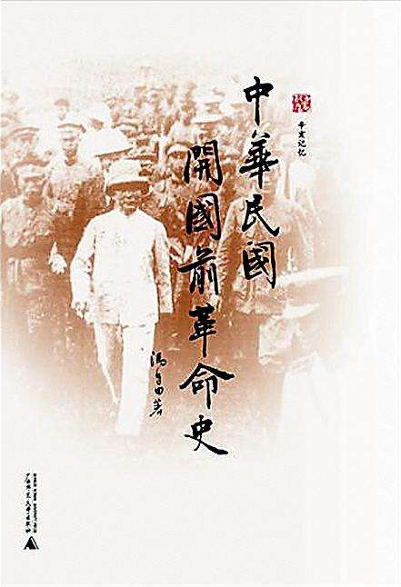
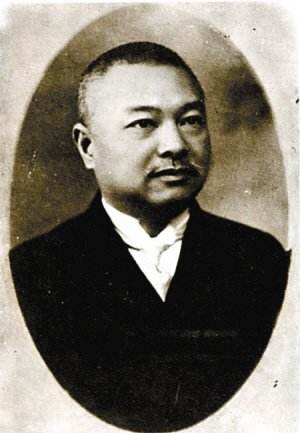
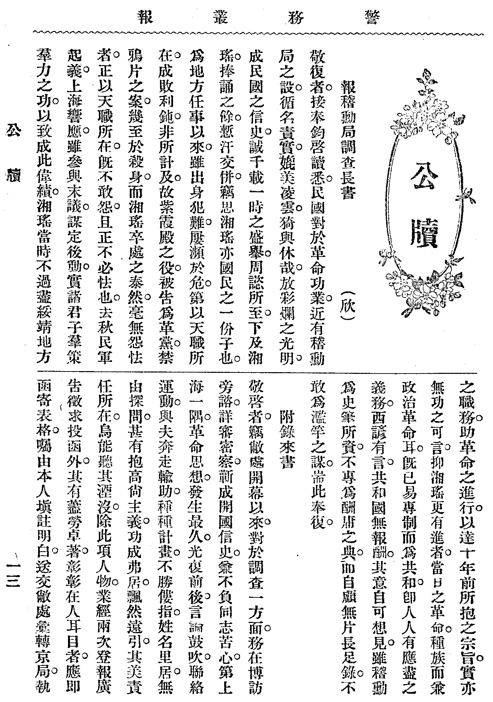

标题1：辛亥革命后一场关于“分饼”的隐秘故事

标题2：中华民国的开国功勋是如何论功行赏的？一场隐秘无聊的分饼大战

（万象历史特约作者：顾亚欣，扬州大学社会发展学院）

 

辛亥革命结束了中国数千年的帝王统治。革命的成功就好比做出了一张美味香甜的大饼。那么，接下来的事就是一起来“分饼”。

（冯自由著《中华民国开国前革命史》）

**一、负责分饼的稽勋局**

干什么事都得有人领头。“分饼”也是这样，总得先拉队伍、搭班子，其他的工作才能开展得起来。所以，临时大总统孙中山提出应该专门成立一个机构来负责“分饼”。一个叫稽勋局的机构就被批准成立了，它是直属国务院的中央机关。

机构成立了，下面就得找人来干事了。这时，已经是袁世凯当总统了，但他还是挺给孙中山面子的，让孙中山推荐的冯自由来当局长。冯自由早年就跟着孙中山一块干革命。帮老孙搞宣传、办党务、筹款子和策动起义，事没少干，认识的人也不少；他很快建起了领导班子。这样，稽勋局就在1912年5月成立了。

（稽勋局局长冯自由）

**二、摸清革命的家底**

领导班子有了，下面就得干事了。第一件事是要把革命者们的经历搞清楚。但这项工作的量太大，而局里头人手有限。光凭这“十几个人七八条枪”，就是不吃不喝累吐了血也干不完啊。所以各地还得搞点分支机构，就算是“临时工”吧。同时还要邀请如黄兴、黎元洪这样的老领导出来对革命事迹进行审查。

这种事看着简单，其实麻烦一大堆。比如，冯国璋坚持要任命他钟爱的杨以德作为当地机构的负责人。可这姓杨的在清朝那会没少杀革命党。这简直就是让黄鼠狼去看鸡窝啊！不过最后也没办法，谁让人家在推翻清廷的时候也出力了呢。

冯国璋这种“满清余孽”跟着搅和搅和也就罢了，咱革命党里的自家兄弟也跟着添乱。比如，工作人员到天津调查时，好多人觉得当年牺牲的同志就是被袁世凯害的，现在居然要我们配合这狗贼派来的人搞什么鸟调查，休想！

不过，功夫不负有心人，经过不断地求爷爷告奶奶，各地陆续在1913年夏天之前把调查整理完的材料送到北京。“分饼”的基础工作好歹算是做完了。

（呈报给稽勋局局长的一份调查书）

**三、难以兑现的分饼方案**

知道了有哪些人可以来“分饼”，下一步就是考虑怎么“分饼”了。大家觉得必须要体现“多劳多得”的原则，根据贡献来定待遇。最后决定：根据参加革命的先后、事迹的重要性等把所有人按贡献大小分成九等，来决定相应的待遇。

当然，凡事都有例外。经过反复审核，把其中100来人视为对革命有重大贡献者，直接给予特别待遇。不过，这种事也不是那么轻易就能搞定的。好多人不服：我参加革命比你早，凭啥你小子就能享受特别待遇？反正这事也没个量化标准，既然我拿不到，那我就去闹，让你也拿不成！有时更是让对手钻了空子。比如，都是革命元勋，孙武和黄兴却一直有矛盾。结果，到了“分饼”时，孙武这个“首义元勋”连个一官半职都没弄到。结果孙武反而和袁世凯走到了一起。

最后“分饼”的标准好歹算是基本定下来了，共有4万多人进入了分饼大名单。可是，名单分批报了上去，袁世凯说手上没钱，以后再说吧。大伙儿就只能大眼瞪小眼了。不过，有些事也兑现了。比如有的人对当官没兴趣，就想出国学点东西，弄个“海龟”当当。好多革命元勋和“革二代”（革命者的子女）就被派出国“镀金”去了。还有的人没上完学就跑出来干革命了；于是就让教育部开证明，让这部分人继续上学，避免了一批大龄“失学儿童”。

（冯自由著《革命逸史》）

**四、戛然而止的分饼之旅**

然而就在“分饼”的章程公布时，袁世凯关于授勋的方案也公布了。因为稽勋局设计的待遇里，也有发勋章这一项，所以好多人把“分饼”和袁世凯的授勋当成了一回事。但袁世凯的授勋搞得太滥，许多人就说冯自由把关不严，让阿猫阿狗也来冒充“革命元勋”，冒领国家的待遇。

更要命的是，1913年7月，孙中山等人发动 “二次革命”，公开造起袁世凯的反来。7月22号，正准备结束“北漂”生活的冯自由被抓了。虽然后来朋友想办法把他“捞”了出来，但稽勋局已经没人管、没人问了。袁世凯就随便找个人来代理代理，也不再干正事。

1914年5月1日，袁世凯索性宣布把稽勋局关闭了。

（裁撤稽勋局的政府公告）

这一场纷纷嚷嚷的“分饼”之旅就这么结束了。这个结局说明革命虽然成功了，但大家显然还没准备好一起建设好这个国家。所以，不但“分饼”这么点小事做不好，国家也是越搞越乱。

留下的，只有那一声叹息……

**本文参考资料来自：**

1、《临时稽勋局官制》，《政府公报》，1912年第84期

2、《报稽勋局调查长书》，《警务丛报》，1912年第15期。

（万象历史特约作者：顾亚欣，扬州大学社会发展学院） 

